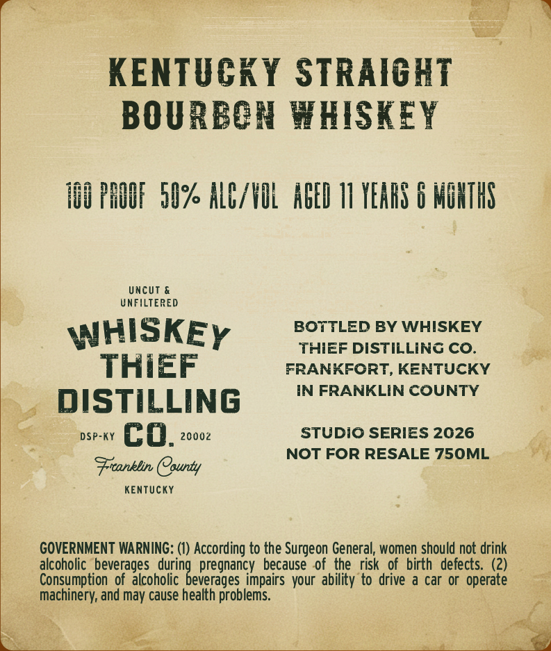
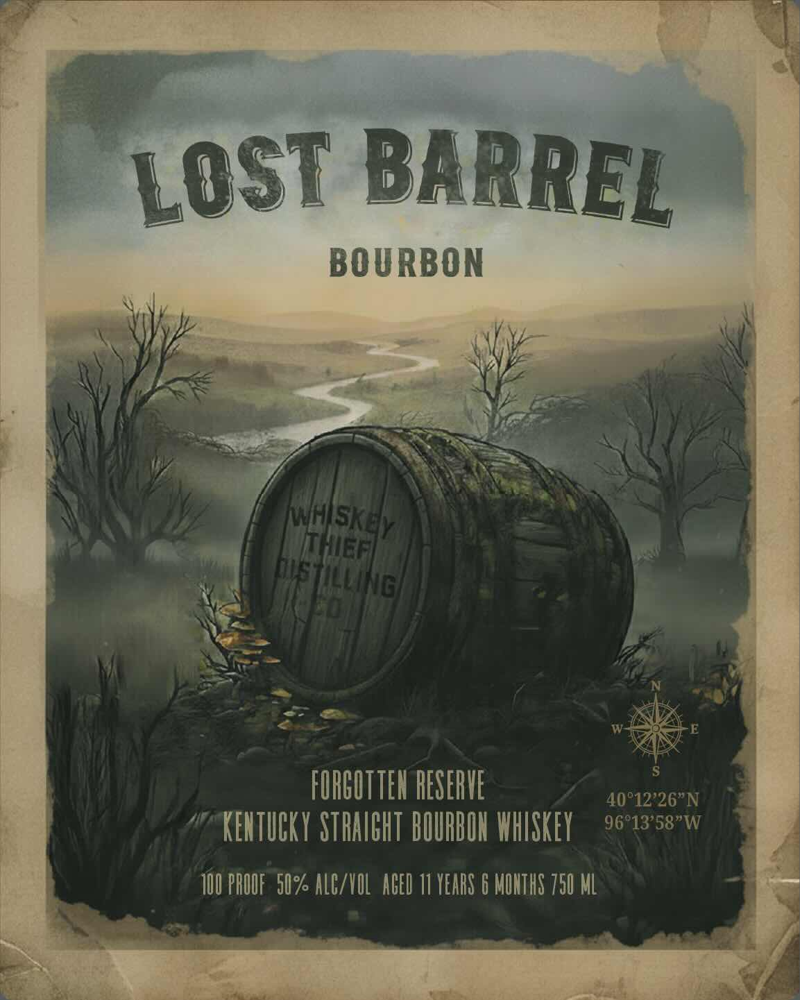

# TTB COLA Label Images - TTBID 26091001000298

**Brand Name:** WHISKEY THIEF DISTILLING CO.

**Fanciful Name:** LOST BARREL BOURBON

**Issue Date:** 04/02/2026

**Origin Code:** 22

**Product Class/Type:** 101

**Source:** [TTB Public COLA Registry](https://ttbonline.gov/colasonline/viewColaDetails.do?action=publicFormDisplay&ttbid=26091001000298)

## Label Images

### Back Label

### Front Label

## Extracted Label Text

*Text extracted via OCR - may contain errors*

**Detected Age:** 11 Years

### Back Label

KENTUCKY STRAIGHT
BOURBOH WHISKEY
H0O PAOOF  5l% ALC/HOL   AEED 11 YEARS 6 MOHTHS
Uncut &
UNFILTERED
BOTTLED BY WHISKEY
WHISKEY
THIeF DISTILLINC CO_
ThIEF
FRANKFORT, KENTUCKY
IN FRANKLIN cOUNTY
dISTILLING
DSP-KY
co.
2000z
STUDIO SERIES 2026
NOT FOR RESALE 750ML
Franklin County
KenTucKy
GOVERNMENT WARNING: (1) According to the Surgeon General, women should not drink
alcoholic  beverages
pregnancy  because   of  the
risk   of birth   defects   (2)
Consumption  of  alcoholic
impairs your ability to drive
a car Or  operate
machinery; and may cause health problems.
duriqgeverages

### Front Label

BARREL
BOURBON
Ihea
bus
"]
FORGUTTEH RESERVE
40912*26"N
KENTUCKY STRAICHT BOURBUH WHISKEY
96813*58"W
IIU PHOUF   5U% ALC/HULACED 11 YEARS 6 MOHTHS 750 ML
LOST
hlSkM
TullInG)
