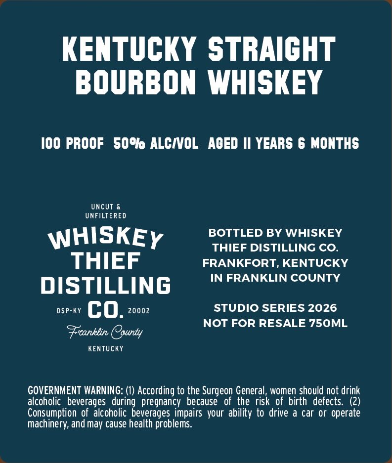
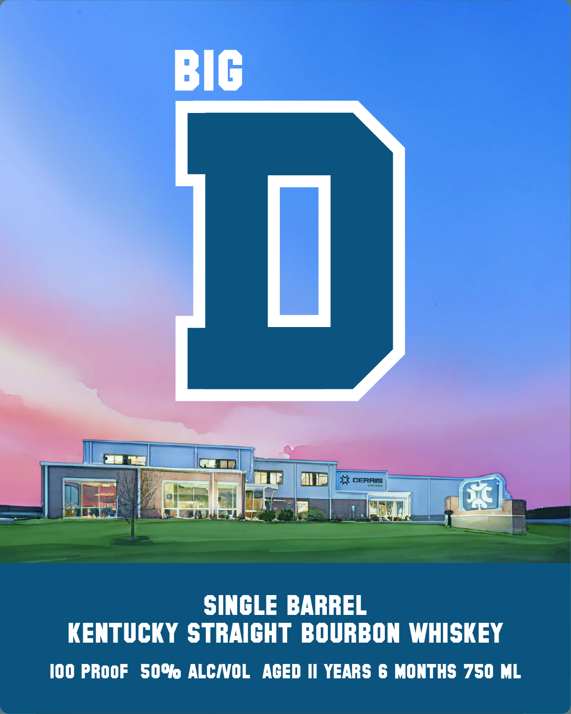

# TTB COLA Label Images - TTBID 26091001000308

**Brand Name:** WHISKEY THIEF DISTILLING CO.

**Fanciful Name:** BIG D

**Issue Date:** 04/02/2026

**Origin Code:** 22

**Product Class/Type:** 101

**Source:** [TTB Public COLA Registry](https://ttbonline.gov/colasonline/viewColaDetails.do?action=publicFormDisplay&ttbid=26091001000308)

## Label Images

### Back Label

### Front Label

## Extracted Label Text

*Text extracted via OCR - may contain errors*

**Detected Proof:** 100

### Back Label

KENTUCKY STRAICHT
BOURBON WHISKEY
I00 PROOF   50%@ ALCIVOL
AGED |I YEARS 6 MONTHS
UncUt &
UNFILTERED
WHISKEY
BOTTLED BY WHISKEY
THIEF DISTILLING CO
THIEF
FRANKFORT, KENTUCKY
IN FRANKLIN COUNTY
DISTILLING
DSP-KY
co.
20002
STUDIO SERIES 2026
NOT FOR RESALE 750ML
Fronklin COounty
KENTUcKY
GOVERNMENT WARNING: (1) According to the Surgeon General, women should not drink
alcoholic   beverages   during  pregnancy because of  the risk of birth defects: (2)
Consumption of  alcoholic beverages impairs your ability to drive a car or operate
machinery; and may cause health problems.

### Front Label

BIG
U
X
CERRIS
SINGLE BARREL
KENTUCKY STRAIGHT BOURBON WHISKEY
I00 PROOF
50% ALCIOL
AGED II YEARS 6 MONTHS 750 ML
