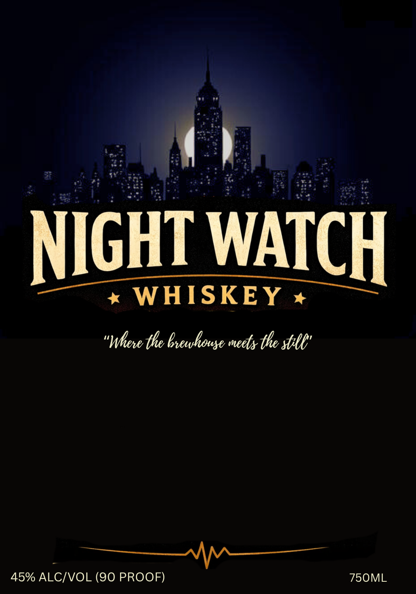
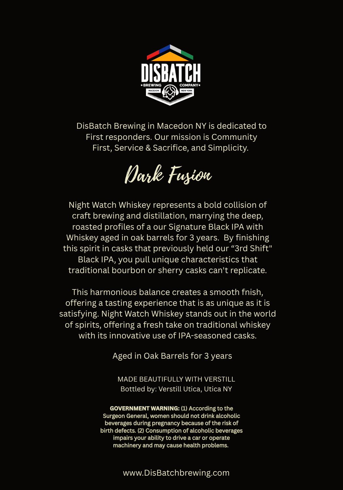

# TTB COLA Label Images - TTBID 26091001000314

**Brand Name:** NIGHT WATCH WHISKEY

**Issue Date:** 04/10/2026

**Origin Code:** 02

**Product Class/Type:** 140

**Source:** [TTB Public COLA Registry](https://ttbonline.gov/colasonline/viewColaDetails.do?action=publicFormDisplay&ttbid=26091001000314)

## Label Images

### Label 1

### Label 2

## Extracted Label Text

*Text extracted via OCR - may contain errors*

*1 image(s) excluded: text did not meet readability threshold*

**Detected Age:** 3 Years

### Label 2

—_

DISBATCH

EOS"

DisBatch Brewing in Macedon NY is dedicated to

First responders. Our mission is Community

First, Service & Sacrifice, and Simplicity.

Dark Fusion

Night Watch Whiskey represents a bold collision of

craft brewing and distillation, marrying the deep,

roasted profiles of a our Signature Black IPA with

Whiskey aged in oak barrels for 3 years. By finishing

this spirit in casks that previously held our “3rd Shift"

Black IPA, you pull unique characteristics that

traditional bourbon or sherry casks can't replicate.

This harmonious balance creates a smooth fnish,

offering a tasting experience that is as unique as it is

satisfying. Night Watch Whiskey stands out in the world

of spirits, offering a fresh take on traditional whiskey

with its innovative use of IPA-seasoned casks.

Aged in Oak Barrels for 3 years

MADE BEAUTIFULLY WITH VERSTILL

Bottled by: Verstill Utica, Utica NY

GOVERNMENT WARNING: (1) According to the

Surgeon General, women should not drink alcoholic

beverages during pregnancy because of the risk of

birth defects. (2) Consumption of alcoholic beverages

impairs your ability to drive a car or operate

machinery and may cause health problems.

www.DisBatchbrewing.com
