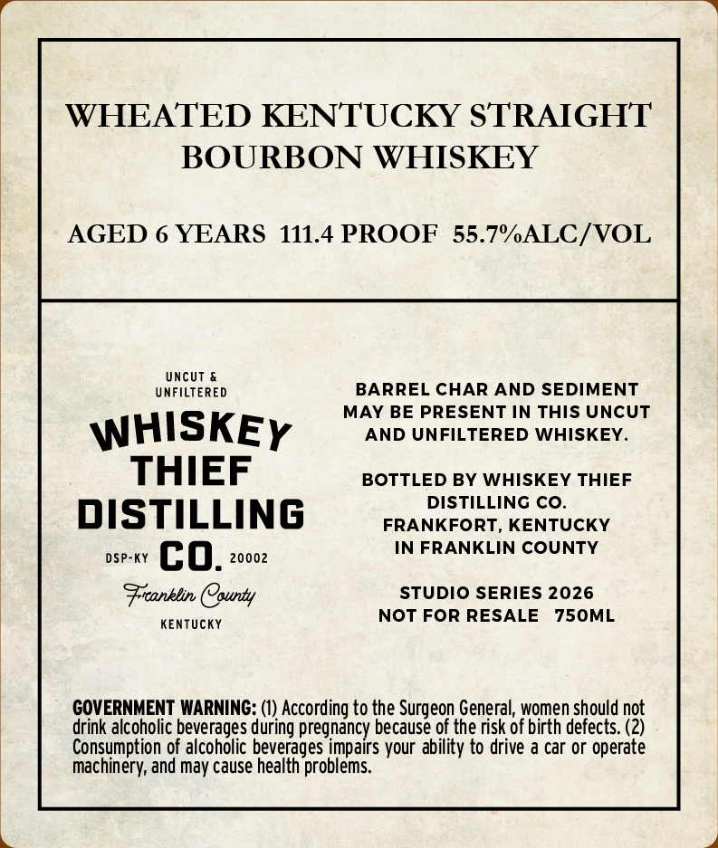
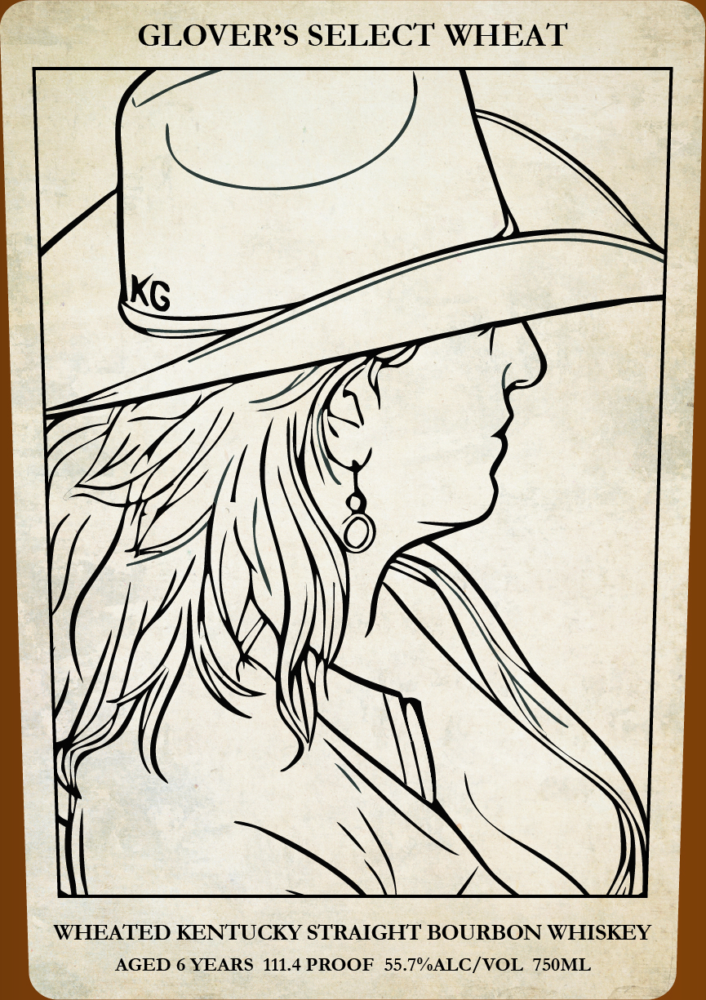

# TTB COLA Label Images - TTBID 26091001000326

**Brand Name:** WHISKEY THIEF DISTILLING CO.

**Fanciful Name:** GLOVER'S SELECT WHEAT

**Issue Date:** 04/02/2026

**Origin Code:** 22

**Product Class/Type:** 101

**Source:** [TTB Public COLA Registry](https://ttbonline.gov/colasonline/viewColaDetails.do?action=publicFormDisplay&ttbid=26091001000326)

## Label Images

### Back Label

### Front Label

## Extracted Label Text

*Text extracted via OCR - may contain errors*

*1 image(s) excluded: text did not meet readability threshold*

**Detected Proof:** 111.4
**Detected Age:** 6 Years

### Back Label

WHEATED KENTUCKY STRAIGHT
BOURBON WHISKEY

AGED 6 YEARS 111.4 PROOF 55.7%ALC/VOL

UNCUT &
UNFILTERED BARREL CHAR AND SEDIMENT

MAY BE PRESENT IN THIS UNCUT

WHISKEy AND UNFILTERED WHISKEY.
THIEF BOTTLED BY WHISKEY THIEF
DISTILLING sranxrorr. kentucky
een co Hanh IN FRANKLIN COUNTY

Franklin (County STUDIO SERIES 2026

KENTUCKY NOT FOR RESALE 750ML

GOVERNMENT WARNING: (1) According to the Surgeon General, women should not
drink alcoholic beverages during pregnancy because of the risk of birth defects. (2)
Consumption of alcoholic beverages impairs your ability to drive a car or operate
machinery, and may cause health problems.
