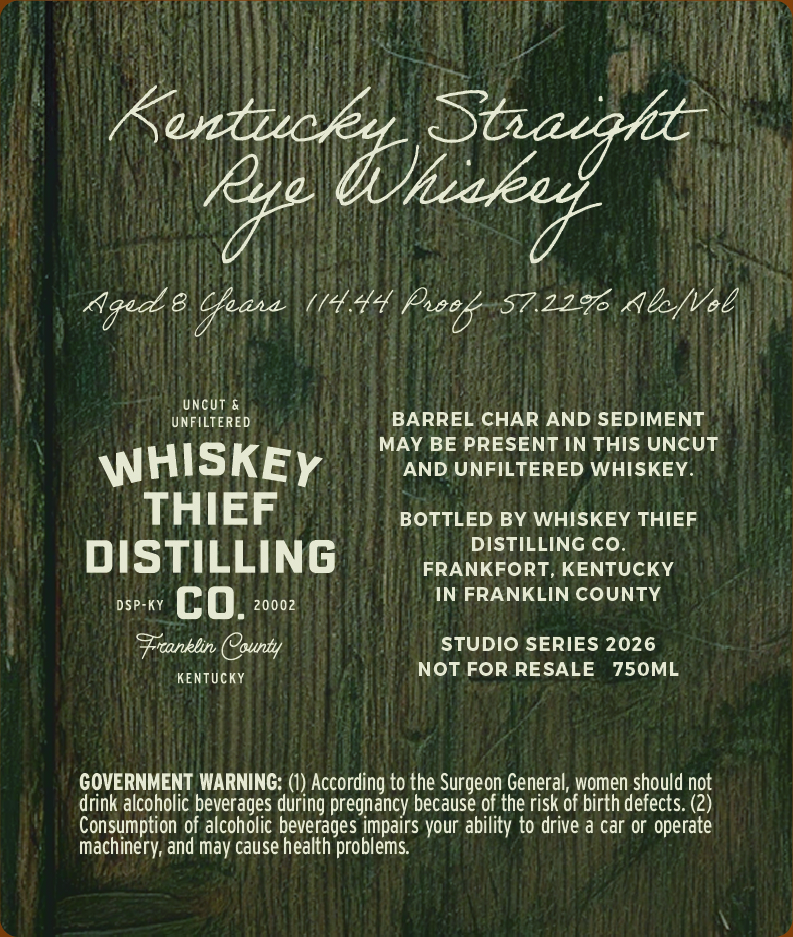
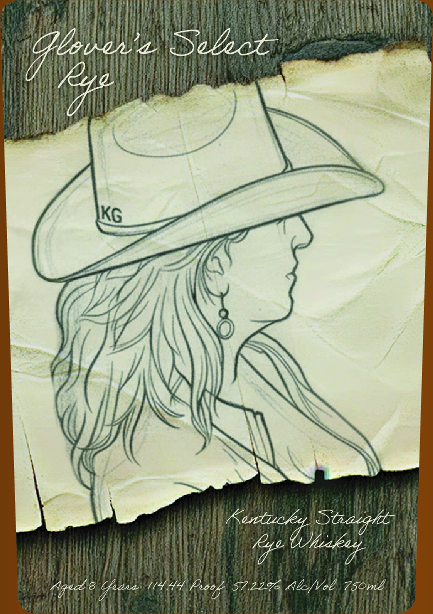

# TTB COLA Label Images - TTBID 26091001000336

**Brand Name:** WHISKEY THIEF DISTILLING CO.

**Fanciful Name:** GLOVER'S SELECT RYE

**Issue Date:** 04/02/2026

**Origin Code:** 22

**Product Class/Type:** 102

**Source:** [TTB Public COLA Registry](https://ttbonline.gov/colasonline/viewColaDetails.do?action=publicFormDisplay&ttbid=26091001000336)

## Label Images

### Back Label

### Front Label

## Extracted Label Text

*Text extracted via OCR - may contain errors*

### Back Label

Staeqht
leye
Aged 8
1/4.44
57.229 Alc/vol
Uncut
UNFILTERED
BARREL CHAR AND SEDIMENT
MAY BE PRESENT IN THIS UNCUT
WHISKEY
AND UNFILTERED WHISKEY
THIEF
BOTTLED BY WHISKEY THIEF
DISTILLING co
DISTILLING
FRANKFORT, KENTUCKY
DSP-KY
co.
20002
IN FRANKLIN COUNTY
Franklin Oounty
STUDIO SERIES 2026
KenTUcKY
NOt FOR RESALE
750ML
GOVERNMENT WARNING: (I) According to the Surgeon General; women should not
drink alcoholic beverages during pregnancy because of the risk of birth defects: (2)
Consumption of alcoholic beverages impairs your ability to drive a car or operate
machinery; and may cause health problems
Koxtuckkhhnknt
pPneeb
Geana

### Front Label

ve RT a Nn ergs dea Pa eG TE EST
fi CAME et Wee, TAN 1}
WALD WOLTT EET HEM A ee Wy enn ar AY Ele adda SLL
HAD POA TL CENT Un THe: , ‘
ie atl Ay
Wi iy Ae
Vai roe
,
— zi
Fs
iy Te ())
ZOOON\
( Awe
) Nga apna :
py 8 py: en Lheey, 30,2270 salad 750mg } f
