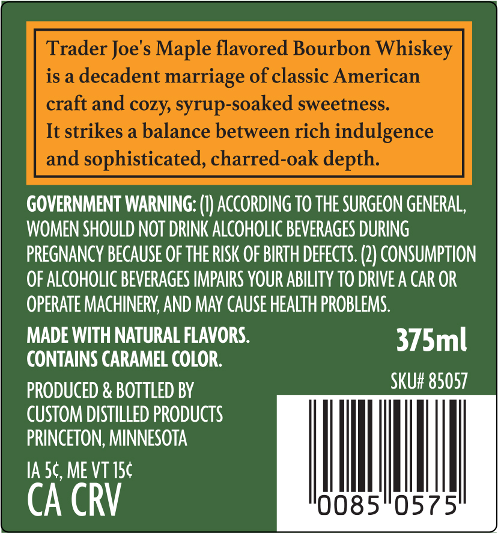
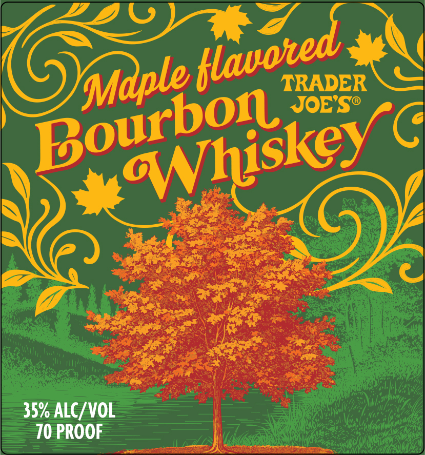

# TTB COLA Label Images - TTBID 26091001000592

**Brand Name:** TRADER JOE'S

**Issue Date:** 04/02/2026

**Origin Code:** 27

**Product Class/Type:** 149

**Source:** [TTB Public COLA Registry](https://ttbonline.gov/colasonline/viewColaDetails.do?action=publicFormDisplay&ttbid=26091001000592)

## Label Images

### Back Label

### Label 1

## Extracted Label Text

*Text extracted via OCR - may contain errors*

*1 image(s) excluded: text did not meet readability threshold*

### Back Label

Trader Joe's Maple flavored Bourbon Whiskey
is a decadent
marriage of classic American
craft and cozy, syrup-soaked sweetness.
It strikes a balance between rich indulgence
and
sophisticated, charred-oak depth:
GOVERNMENT WARNING: (I) ACcORDING TO THE SURGEON GENERAL,
WOMEN SHOULD NOT DRINK ALCOHOLIC BEVERAGES DURING
PREGNANCY BECAUSe OF THE RISK OF BIRTH DEfEcTS: (2) CONSUMPTION
OF ALCOHOLIC BEVERAGES IMPAIRS YOUR ABILITY TO DRIVE A CAR OR
OPERATE MACHINERY; AND MaY CAUSE HEALTH PROBLEMS:
MADE WITH NATURAL FLAVORS.
375ml
CONTAINS CARAMEL COLOR:
PRODUCED & BOTTLED BY
SKU# 85057
CUSTOM DISTILLED PRODUCTS
PRINCETON; MINNESOTA
IA 5c, ME VT ISc
CA CRV
0085
0575
