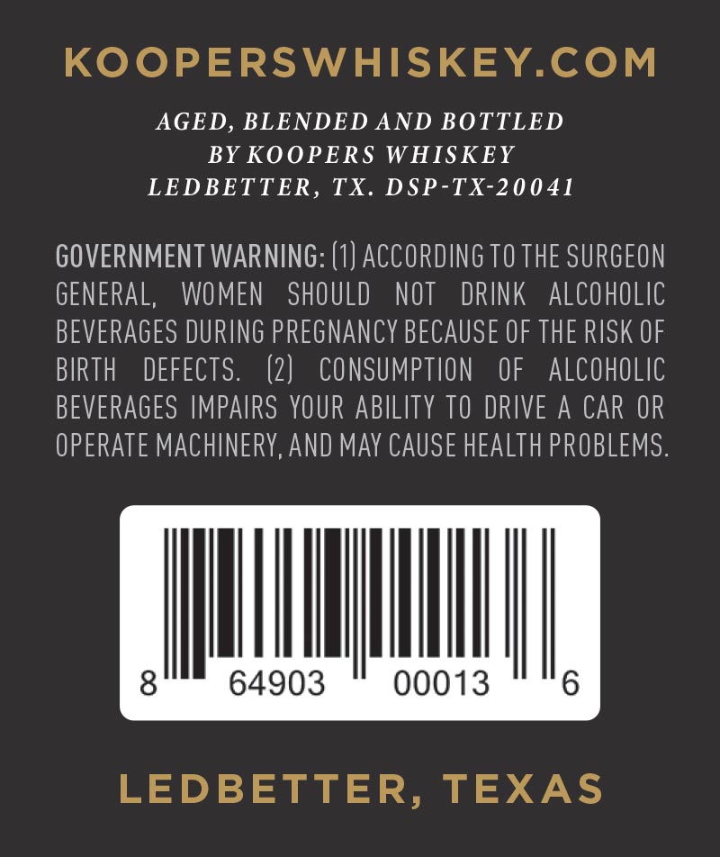

# TTB COLA Label Images - TTBID 26091001000648

**Brand Name:** KOOPERS

**Fanciful Name:** SWEETHEART OF THE RODEO BOURBON

**Issue Date:** 04/03/2026

**Origin Code:** 44

**Product Class/Type:** 121

**Source:** [TTB Public COLA Registry](https://ttbonline.gov/colasonline/viewColaDetails.do?action=publicFormDisplay&ttbid=26091001000648)

## Label Images

### Back Label

## Extracted Label Text

*Text extracted via OCR - may contain errors*

### Back Label

KOoPERSWHISKEYCOM
AGED, BLENDED AND BOTTLED
BY KOOPERS WHISKEY
LEDBETTER, TX. DSP-TX-20041
GOVERNMENT WARNING: (1) ACCORDING TO THE SURGEON
GENERAL,
WOMEN
SHOULD
NOT
DRINK
alcohoLic
BEVERAGES DURING PREGNANCY BECAUSE OF THE RISK OF
BIRTH
DEFECTS.
(2)
CONSUMPTION
OF
alcohoLic
BEVERAGES IMPAIRS YOUR ABILITY TO DRIVE A CAR OR
OPERATE MACHINERY,ANd May CAUSE HEALTH PROBLEMS .
8
64903
00013
6
LEDBETTER, TEXAS
