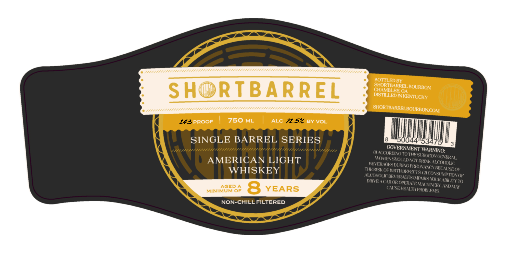

# TTB COLA Label Images - TTBID 26091001000682

**Brand Name:** SHORTBARREL

**Fanciful Name:** SINGLE BARREL SERIES

**Issue Date:** 04/02/2026

**Origin Code:** 08

**Product Class/Type:** 144

**Source:** [TTB Public COLA Registry](https://ttbonline.gov/colasonline/viewColaDetails.do?action=publicFormDisplay&ttbid=26091001000682)

## Label Images

### Label 1

## Extracted Label Text

*Text extracted via OCR - may contain errors*

**Detected Proof:** 143
**Detected Age:** 8 Years

### Label 1

BOTTLED BY
SHORTBARRELBOURBON
Sh
RTBARREL
OSMBEDE RENTUCKY
SHORTBARRELBOURBONCOM
143pROOF
750 ML
ALC
71.57 BY VOL
SINGLE BARREL SERIES
04
534
1711/11181111471111111171111111811/11117
GOVERNMENT WARNING:
CCORDINGTO THESL RGTONE
AMERICAN LIGHT
VRNESDON UNVaTSUNAONcONOLK
EVER NCESDU RAGPREGNAVC)
WHISKEY
THERISKk OF WKIHDFECIS
'BECALSEOf'
ALLONHOUc LENtHNTScMCNRS YOLR MizOsOF
DRAEA( AROR OPLRATE
YOl RAPU4TY 70
AGED A
8
YEARS
GROROHEREIFMUHAE' LNd MN"
MINIMUM OF
US
NON-CHILL FILTERED
