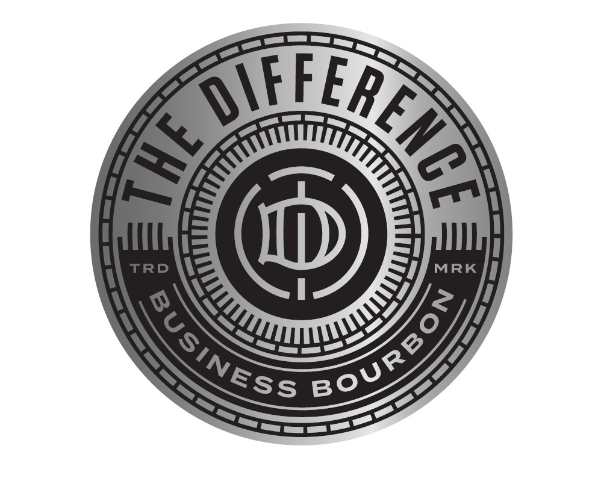
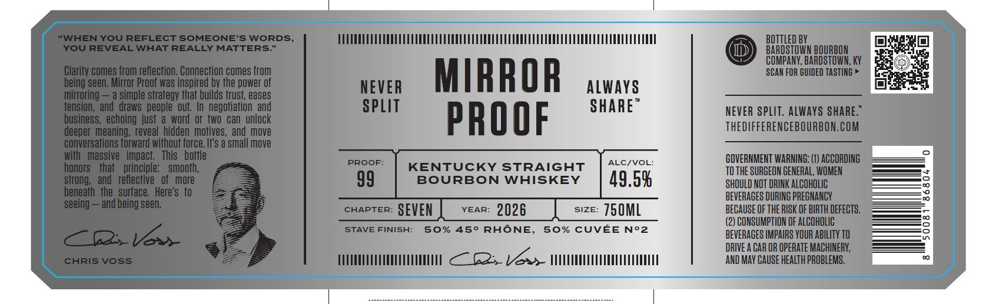
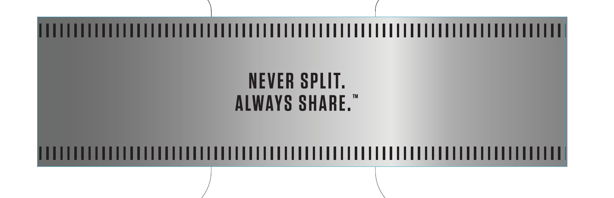

# TTB COLA Label Images - TTBID 26091001000720

**Brand Name:** THE DIFFERENCE

**Issue Date:** 04/02/2026

**Origin Code:** 22

**Product Class/Type:** 101

**Source:** [TTB Public COLA Registry](https://ttbonline.gov/colasonline/viewColaDetails.do?action=publicFormDisplay&ttbid=26091001000720)

## Label Images

### Back Label

### Label 2

### Label 3

## Extracted Label Text

*Text extracted via OCR - may contain errors*

*2 image(s) excluded: text did not meet readability threshold*

**Detected Proof:** 100

### Label 2

"WHENYOU REFLECT SOMEONE'S WORDS
BOTiLED BY
YOU REVEAL WHAT REALLY MATTERS_
BARDSTOQWN BQURBON
COMPANY, BARDSTOWN; KY
Clarity comes from reflection. Connection comes from
MIRROR
SCAN FOR GUIDED TASTING
being seen. Mirror Proof was inspired by the power of
NEVER
Always
mirroring
a simple strategv thaf builds frust; eases
tension,` and  draws  people  out.
negotiation
SPLIT
SHARE"
NEVER SPLIT: ALWAYS SHARE:"
business, echoing  just a word
or  fwo   can   unlock
PROOF
THEDIFFERENCEBOURBON.COM
deeper  meaning, reveal  hidden  motives, and  move
conversations forward without force. If's a small move
with   massive   impact   This   bottle
GOVERNMENT WARNING: (1) ACCORDING
honors
that
principle:
smooth;
PROOF
KENTUCKY STRAIGHT
ALC/VOL:
TO THE SURGEON GENERAL, WOMEN
strong   and   reilective   of   more
99
BOURBON
WHISKEY
49.58
SHOULD NOT DRINK ALCOHOLIC
beneath  the   surface  Here's   t0
BEVERAGES DURING PREGNANCY
seeing
and being seen.
CHAPTER:
SEVEN
YEAR:
2026
SIZE:
750ML
BECAUSE OF THE RISK OF BIRTH DEFECTS.
(2) CONSUMPTION OF ALCOHOLIC
8
STAVE FINISH:
50%
450
RHONE,
50% CUVEE
No2
BEVERAGES IMPAIRS YOUR ABILITY TO
E6V
DRIVE A CAR OR OPERATE MACHINERY,
CHRIS Voss
Vax
AND May CAUSE HeALTh PROBLEMS.
and
