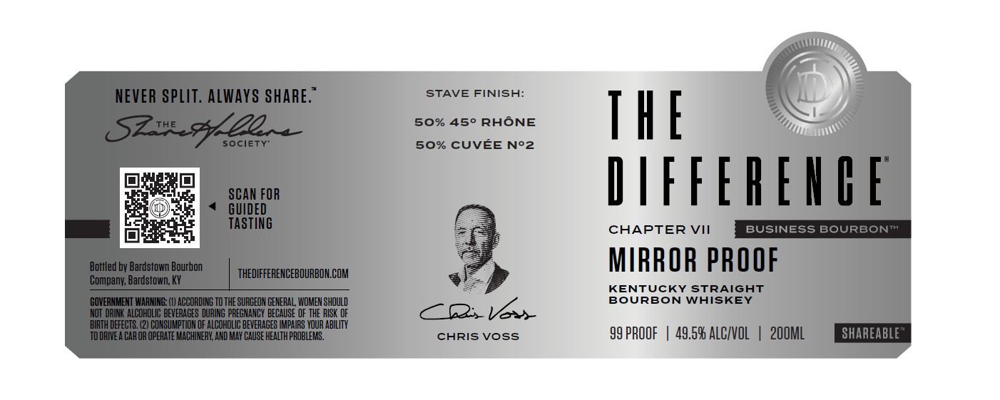

# TTB COLA Label Images - TTBID 26091001000727

**Brand Name:** THE DIFFERENCE

**Issue Date:** 04/02/2026

**Origin Code:** 22

**Product Class/Type:** 101

**Source:** [TTB Public COLA Registry](https://ttbonline.gov/colasonline/viewColaDetails.do?action=publicFormDisplay&ttbid=26091001000727)

## Label Images

### Label 1

## Extracted Label Text

*Text extracted via OCR - may contain errors*

**Detected Proof:** 99

### Label 1

NEVER SPLIT: ALWAYS SHARE:"
STAVE FINISH:
S2ul_5y2L A
50% 450 RHONE
THE
Society-
s0% CUVEE N'2
SCAN FOR
IIFFFREUHE
GUIDED
TASTING
CHAPTER VII
BUSINESS BOURBONTA
Bottled by Bardstown Bourbon
MIRROR PROOF
THEDIFFERENCEBOURBON COM
Company; Bardstown; KY
KENTUCKY STRAIGHT
GOVERNMENT WARMING: (I) ACCORDIKG TO THE SURGEON GENERAL; WOMEN shOuLD
BoURBON WAISKEY
NOT DRINK ALCOHOLIC BEVERAGES DURING PREGMANCY BECAUSE OF ThE RISK OF
Vax
BIRTH DEFECTS, (2) CONSUMPTION OF ALCOHOLIC BEVERAGES IMPAIRS YOUR AbilITy
TO DRIVEA CAR OR OPERATE MACHINERK, AKD MAY CAUSE HEALTH PROBLEMS .
CHRIS Voss
99 PROOF
49.59 ALCIVOL
2OOML
SHAREABLE"
