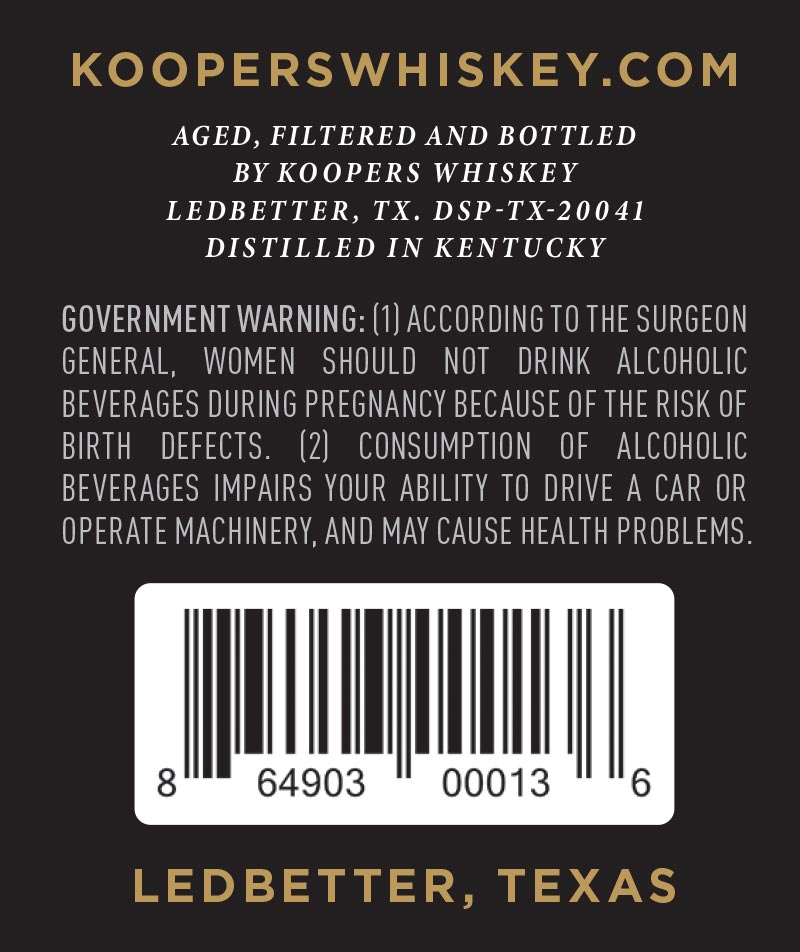
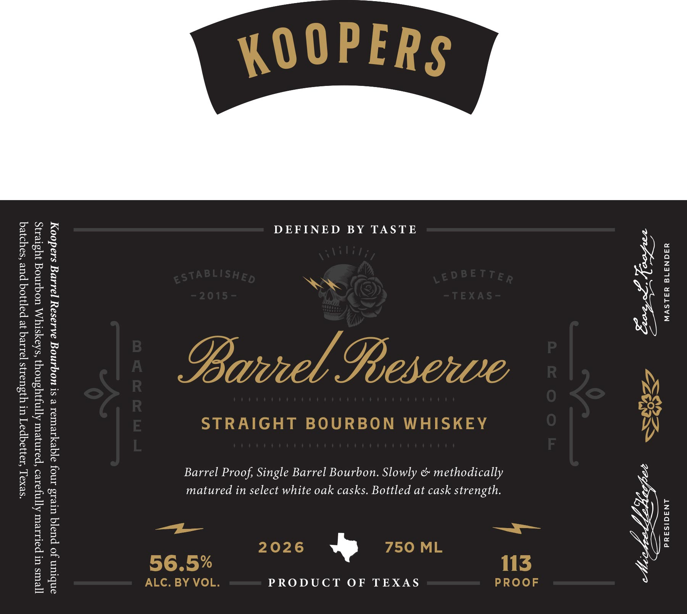

# TTB COLA Label Images - TTBID 26091001000731

**Brand Name:** KOOPERS

**Fanciful Name:** BARREL RESERVE BOURBON

**Issue Date:** 04/06/2026

**Origin Code:** 44

**Product Class/Type:** 101

**Source:** [TTB Public COLA Registry](https://ttbonline.gov/colasonline/viewColaDetails.do?action=publicFormDisplay&ttbid=26091001000731)

## Label Images

### Back Label

### Front Label

## Extracted Label Text

*Text extracted via OCR - may contain errors*

### Back Label

KOOPERSWHISKEY.COM

AGED, FILTERED AND BOTTLED

BY KOOPERS WHISKEY

LEDBETTER, TX. DSP-TX-20041

DISTILLED IN KENTUCKY

GOVERNMENT WARNING: (1) ACCORDING 10 THE SURGEON

GENERAL, WOMEN SHOULD NOT DRINK ALCOHOLIC

BEVERAGES DURING PREGNANCY BECAUSE OF THE RISK OF

BIRTH DEFECTS

(2) CONSUMPTION OF ALCOHOLIC

BEVERAGES IMPAIRS YOUR ABILITY TO DRIVE A CAR OR

OPERATE MACHINERY, AND MAY CAUSE HEALTH PROBLEMS

tu

64903

00013

6

LEDBETTER, TEXAS

### Front Label

Y3S0N319 YSLSVW ANAGISAad

DEFINED BY TASTE

Barrel Proof, Single Barrel Bourbon. Slowly & methodically
matured in select white oak casks. Bottled at cask strength
PRODUCT OF TEXAS

Koopers Barrel Reserve Bourbon is a remarkable four grain blend of unique
Straight Bourbon Whiskeys, thoughtfully matured, carefully married in small
batches, and bottled at barrel strength in Ledbetter, Texas.
