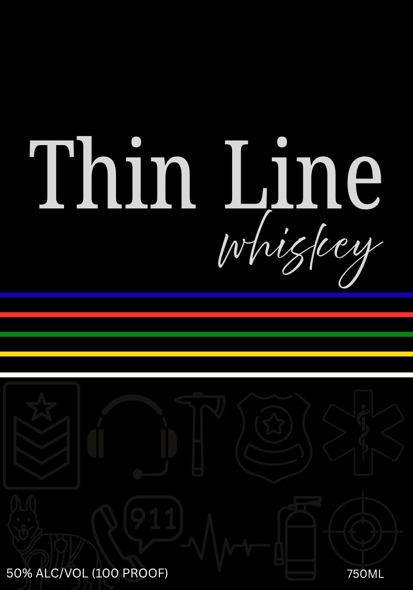
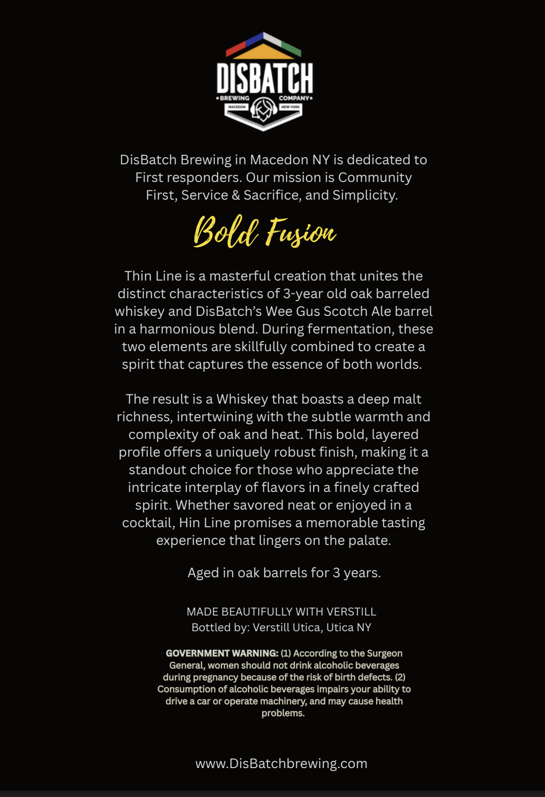

# TTB COLA Label Images - TTBID 26091001000804

**Brand Name:** THIN LINE WHISKEY

**Issue Date:** 04/15/2026

**Origin Code:** 02

**Product Class/Type:** 140

**Source:** [TTB Public COLA Registry](https://ttbonline.gov/colasonline/viewColaDetails.do?action=publicFormDisplay&ttbid=26091001000804)

## Label Images

### Label 1

### Label 2

## Extracted Label Text

*Text extracted via OCR - may contain errors*

*1 image(s) excluded: text did not meet readability threshold*

**Detected Age:** 3 Years

### Label 2

DISBATCH
DREIING
COHPANY
DisBatch Brewing in Macedon NY is dedicated to
First responders. Our mission is Community
First, Service & Sacrifice, and Simplicity:
Bold Fusiou
Thin Line is a masterful creation that unites the
distinct characteristics of 3-year old oak barreled
whiskey and DisBatch's Wee Gus Scotch Ale barrel
in a harmonious blend. During fermentation, these
two elements are skillfully combined to create a
spirit that captures the essence of both worlds:
The result is a Whiskey that boasts a deep malt
richness, intertwining with the subtle warmth and
complexity of oak and heat: This bold; layered
profile offers a uniquely robust finish; making it a
standout choice for those who appreciate the
intricate interplay of flavors in a finely crafted
spirit. Whether savored neat or enjoyed in a
cocktail, Hin Line promises a memorable tasting
experience that lingers on the palate
Aged in oak barrels for 3 years
MADE BEAUTIFULLY WITH VERSTILL
Bottled by: Verstill Utica; Utica NY
GOVERNMENT WARNING: (1) According to the Surgeon
General, women should not drink alcoholic beverages
during pregnancy because of the risk of birth defects: (2)
Consumption of alcoholic beverages impairs your ability to
drive a car or operate machinery; and may cause health
problems:
WWW
DisBatchbrewing com
