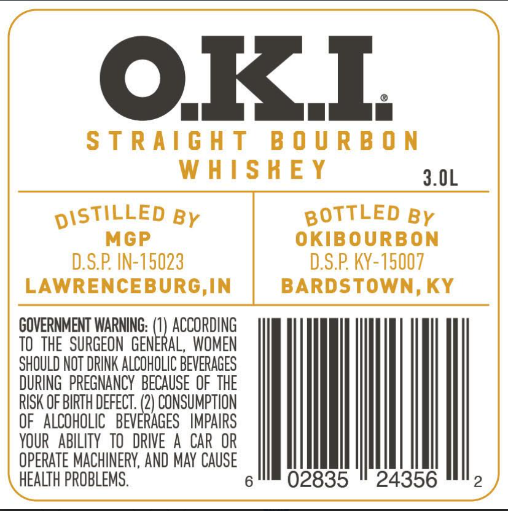
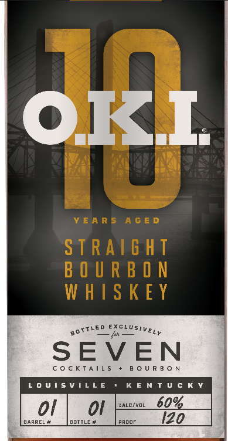

# TTB COLA Label Images - TTBID 26091001000807

**Brand Name:** O.K.I.

**Issue Date:** 04/08/2026

**Origin Code:** 22

**Product Class/Type:** 101

**Source:** [TTB Public COLA Registry](https://ttbonline.gov/colasonline/viewColaDetails.do?action=publicFormDisplay&ttbid=26091001000807)

## Label Images

### Back Label

### Front Label

## Extracted Label Text

*Text extracted via OCR - may contain errors*

### Back Label

OKI

STRAIGHT BOURBON

WHISHEY

3.0L

grsviLL.b By

BOTTLED By

MGP

OKIBOURBON

D.S.P. IN-15023

D.S.P. KY-15007

LAWRENCEBURG,IN

BARDSTOWN, KY

GOVERNMENT WARNING:

ACCORDING

TO THE SURGEON GE

ik

‘AL, WOMEN

SHOULD NOT DRINK ALCOHOLIC BEVERAGES

DURING PREGNANCY BECAUSE OF THE

RISK OF BIRTH DEFECT.

OF ALCOHOLIC BEV

RAGES IMPAIRS

2) CONSUMPTION

YOUR ABILITY TO DRIVE A CAR OR

OPERATE MACHINERY, AND MAY CAUSE

|

HEALTH PROBLEMS

6

2

### Front Label

OFT.

got

THe EXELUSI va,

SEVEN

COCKTAILS

BOURBON

LOUISVILLE

KENTUCKY

oF
