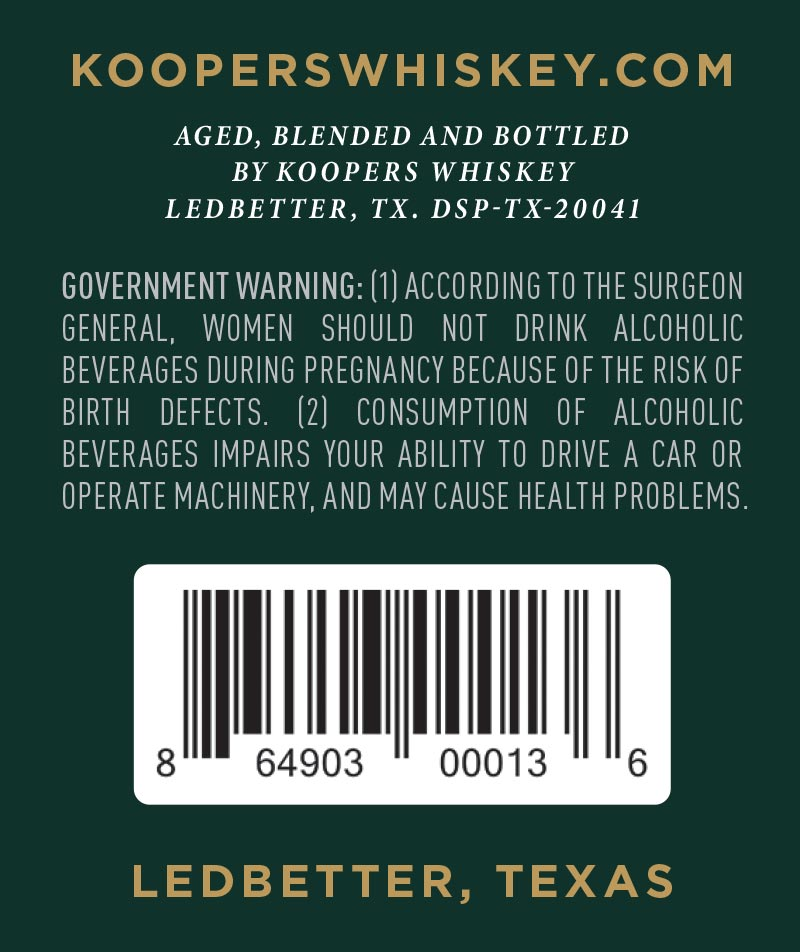
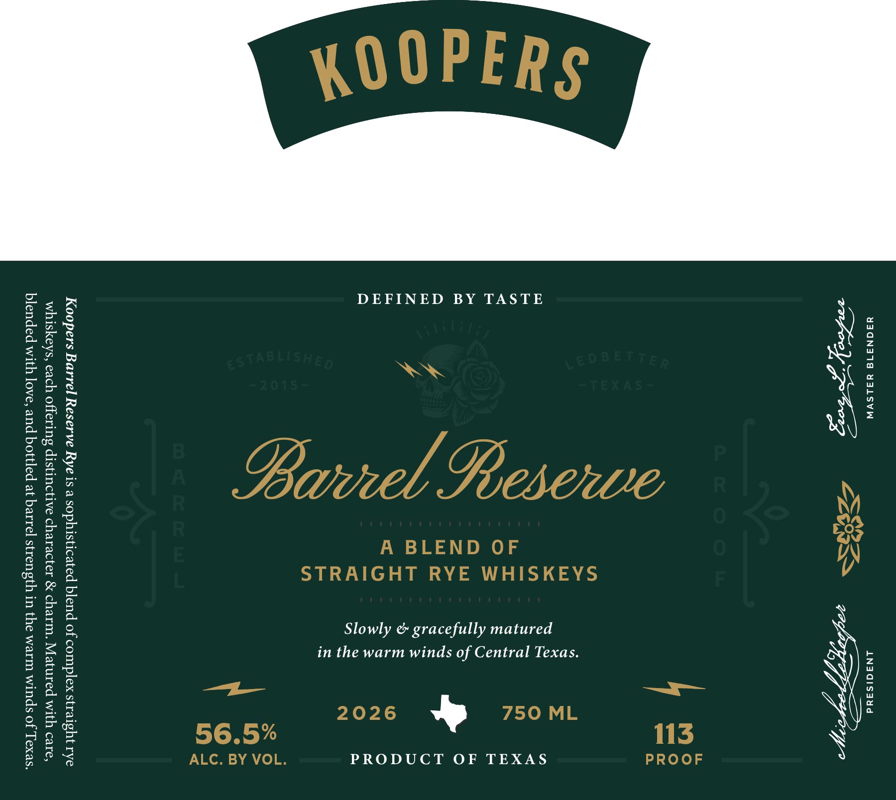

# TTB COLA Label Images - TTBID 26091001000831

**Brand Name:** KOOPERS

**Fanciful Name:** BARREL RESERVE RYE

**Issue Date:** 04/02/2026

**Origin Code:** 44

**Product Class/Type:** 122

**Source:** [TTB Public COLA Registry](https://ttbonline.gov/colasonline/viewColaDetails.do?action=publicFormDisplay&ttbid=26091001000831)

## Label Images

### Back Label

### Front Label

## Extracted Label Text

*Text extracted via OCR - may contain errors*

### Back Label

KOOPERSWHISKEY.COM

AGED, BLENDED AND BOTTLED

BY KOOPERS WHISKEY

LEDBETTER, TX. DSP-TX-20041

GOVERNMENT WARNING: (1) ACCORDING T0 THE SURGEON

GENERAL, WOMEN SHOULD NOT DRINK ALCOHOLIC

BEVERAGES DURING PREGNANCY BECAUSE OF THE RISK OF

BIRTH DEFECTS

(2) CONSUMPTION OF ALCOHOLIC

BEVERAGES IMPAIRS YOUR ABILITY T0 DRIVE A CAR OR

OPERATE MACHINERY, AND MAY CAUSE HEALTH PROBLEMS

ut

64903

00013

6

LEDBETTER, TEXAS

### Front Label

4YS30N319 YALSVW ANAGISaud

sacha Pair ATG PY

DEFINED BY TASTE
Slowly & gracefully matured
in the warm winds of Central Texas.
PRODUCT OF TEXAS

Koopers Barrel Reserve Rye is a sophisticated blend of complex straight rye
whiskeys, each offering distinctive character & charm. Matured with care,
blended with love, and bottled at barrel strength in the warm winds of Texas.
