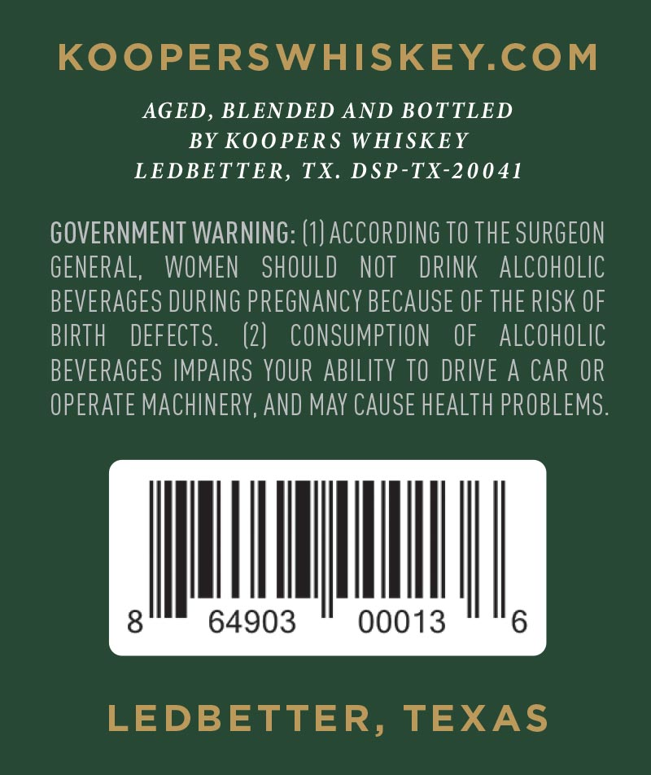
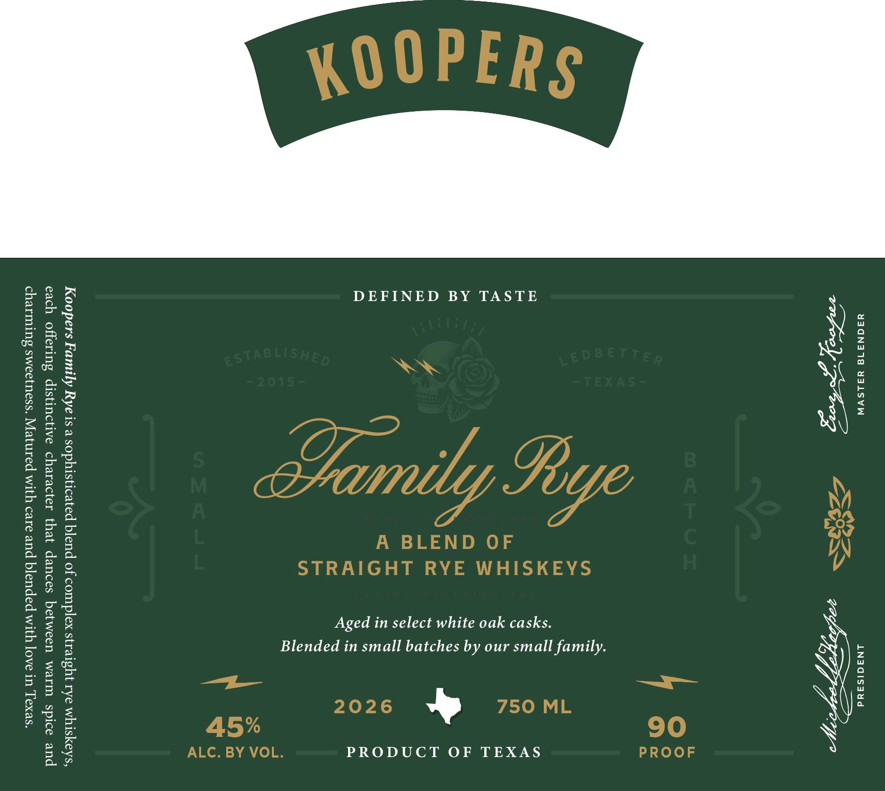

# TTB COLA Label Images - TTBID 26091001000838

**Brand Name:** KOOPERS

**Fanciful Name:** FAMILY RYE

**Issue Date:** 04/06/2026

**Origin Code:** 44

**Product Class/Type:** 122

**Source:** [TTB Public COLA Registry](https://ttbonline.gov/colasonline/viewColaDetails.do?action=publicFormDisplay&ttbid=26091001000838)

## Label Images

### Back Label

### Front Label

## Extracted Label Text

*Text extracted via OCR - may contain errors*

### Back Label

KOOPERSWHISKEY.COM

AGED, BLENDED AND BOTTLED

BY KOOPERS WHISKEY

LEDBETTER, TX. DSP-TX-20041

GOVERNMENT WARNING: (1} ACCORDING TO THE SURGEON

GENERAL, WOMEN SHOULD NOT DRINK ALCOHOLIC

BEVERAGES DURING PREGNANCY BECAUSE OF THE RISK OF

BIRTH DEFECTS

(2} CONSUMPTION OF ALCOHOLIC

BEVERAGES IMPAIRS YOUR ABILITY 10 DRIVE A CAR OR

OPERATE MACHINERY, AND MAY CAUSE HEALTH PROBLEMS

Uy)

64903

00013

LEDBETTER, TEXAS

### Front Label

YSQN318 YALSVW ANAGISSad

DEFINED BY TASTE
Aged in select white oak casks
Blended in small batches by our small family.
PRODUCT OF TEXAS

Koopers Family Rye is a sophisticated blend of complex straight rye whiskeys,
each offering distinctive character that dances between warm spice and
charming sweetness. Matured with care and blended with love in Texas.
