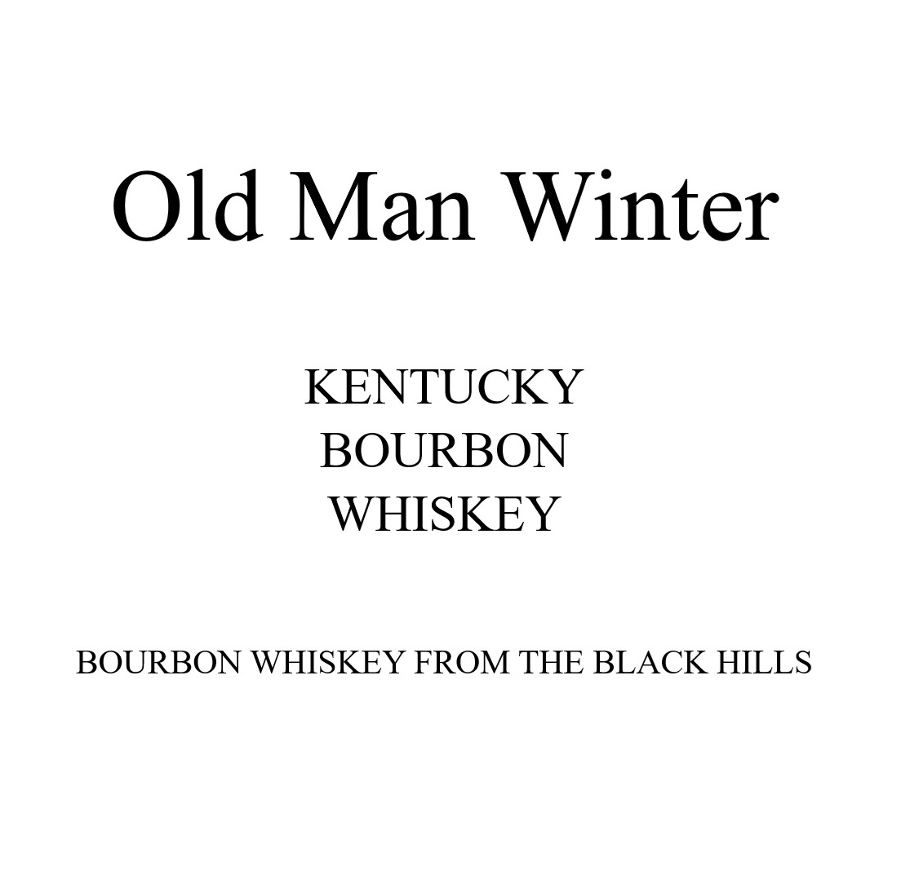
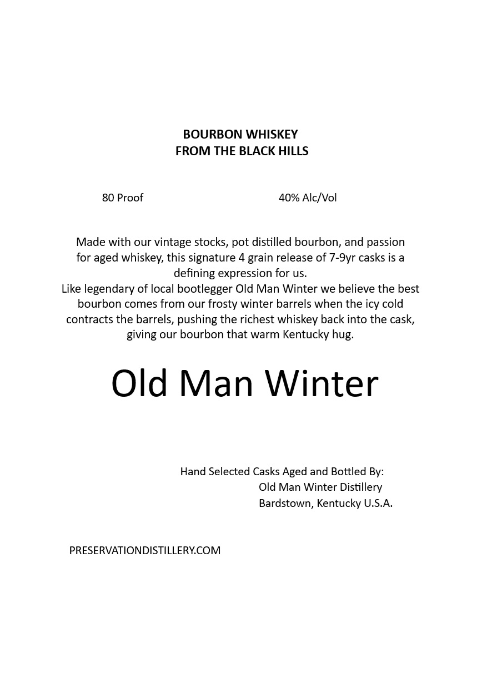

# TTB COLA Label Images - TTBID 26091001000874

**Brand Name:** OLD MAN WINTER

**Issue Date:** 04/06/2026

**Origin Code:** 22

**Product Class/Type:** 141

**Source:** [TTB Public COLA Registry](https://ttbonline.gov/colasonline/viewColaDetails.do?action=publicFormDisplay&ttbid=26091001000874)

## Label Images

### Back Label

### Front Label

### Label 3

## Extracted Label Text

*Text extracted via OCR - may contain errors*

**Detected Proof:** 80
**Detected Age:** 9 Years

### Back Label

Old Man Winter

KENTUCKY

BOURBON

WHISKEY

BOURBON WHISKEY FROM THE BLACK HILLS

### Front Label

BOURBON WHISKEY
FROM THE BLACK HILLS
80 Proof
40% AlcNVol
Made with our vintage stocks, pot distilled bourbon, and passion
for aged whiskey, this signature 4
release of 7-9yr casks is a
defining expression for us.
Like legendary of local bootlegger Old Man Winter we believe the best
bourbon comes from our frosty winter barrels when the icy cold
contracts the barrels, pushing the richest whiskey back into the cask,
giving our bourbon that warm Kentucky hug:
Old Man Winter
Hand Selected Casks Aged and Bottled By:
Old Man Winter Distillery
Bardstown, Kentucky U.S.A.
PRESERVATIONDISTILLERYCOM
grain

### Label 3

GOVERNMENT WARNING:
ACCORDING
TO
THE
SURGEON
GENERAL
INGmEr) AGOBD8
NOT
DRINK
AicoHoLic
BEVERAGES
DURiNG
PREGNANCY
BECAUSE
OF
THE
RISK
OF
BIRTH
DEFFECTS
2
CONSUMpTION
OF
Alcohoic
BEVERAGES
IMPAIRS
YOUR
ABILITY
TO
DRIVE
A
CAR
OR
OPERATE
MACHINERY
And
MAY
CAUSE
UPC - FOR POSITION ONLY
HeALTH
PROBLEMS:
750ml
