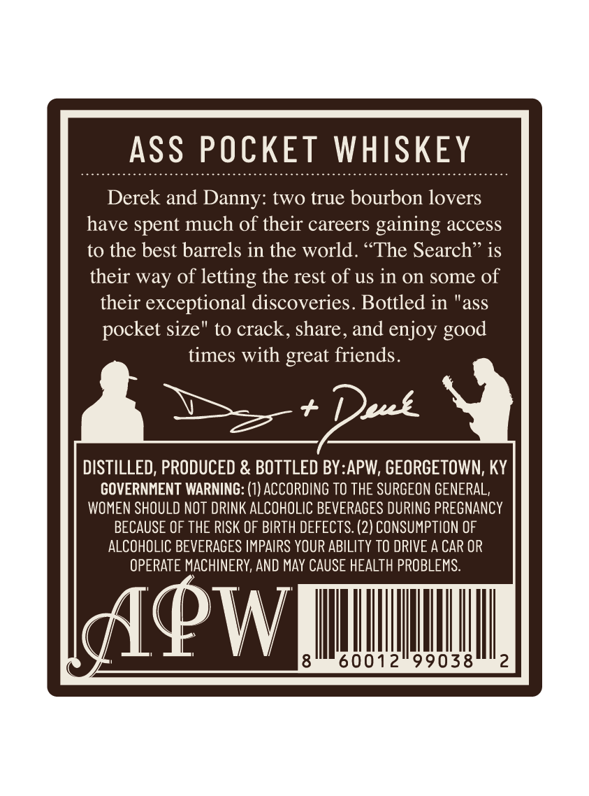
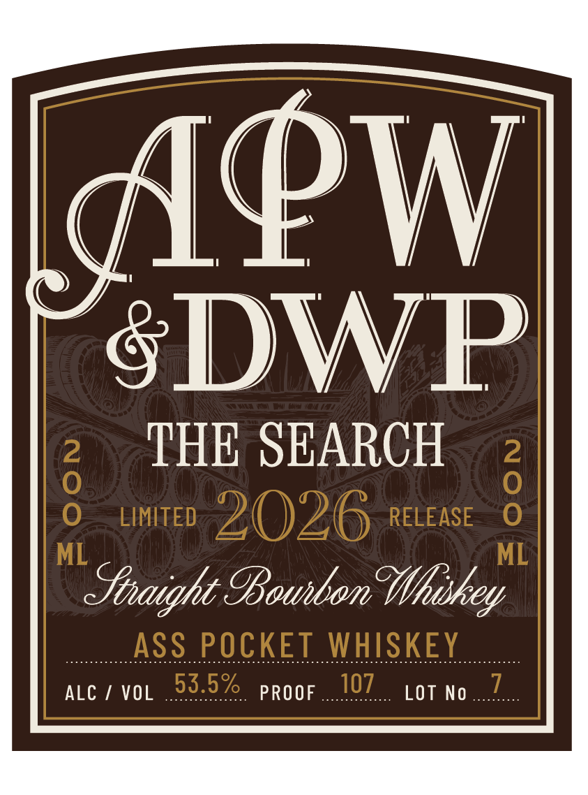

# TTB COLA Label Images - TTBID 26092001000088

**Brand Name:** ASS POCKET WHISKEY

**Issue Date:** 04/22/2026

**Origin Code:** 22

**Product Class/Type:** 101

**Source:** [TTB Public COLA Registry](https://ttbonline.gov/colasonline/viewColaDetails.do?action=publicFormDisplay&ttbid=26092001000088)

## Label Images

### Back Label

### Front Label

## Extracted Label Text

*Text extracted via OCR - may contain errors*

**Detected Proof:** 107

### Back Label

ASS POCKET WHISKEY

Derek and Danny: two true bourbon love

ave spent much of their careers gaining access

to the best barrels in the world. “The Search

their way of letting the rest of us in on some of

their exceptional discoveries. Bottled in "ass

pocket size" to crack, share, and enjoy good

times with great friends

at pot

DISTILLED, PRODUCED & BOTTLED BY:APW, GEORGETOWN, KY

GOVERNMENT WARNING: (1) ACCORDING TO THE SURGEON GENERAL,

WOMEN SHOULD NOT DRINK ALCOHOLIC BEVERAGES DURING PREGNANCY

BECAUSE OF THE RISK OF BIRTH DEFECTS. (2) CONSUMPTION OF

ALCOHOLIC BEVERAGES IMPAIRS YOUR ABILITY TO DRIVE A CAR OR

OPERATE MACHINERY, AND MAY CAUSE HEALTH PROBLEMS.

(|

PW

Wu

HUI

### Front Label

APW
SDWP
8
THE SEARCH
2
0
LIMITED
2026
RELEASE
ML
ML
Snaight 9Bounbom Whiskey
ASS POCKET WHISKEY
ALC
VOL
53.5%
PROOF
107
LOT No
7
