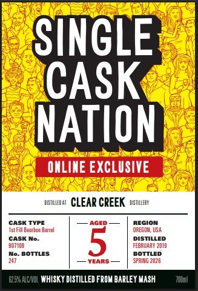
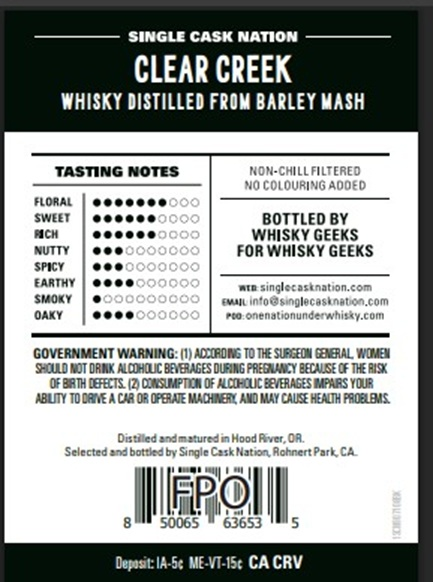

# TTB COLA Label Images - TTBID 26092001000137

**Brand Name:** SINGLE CASK NATION

**Fanciful Name:** CLEAR CREEK

**Issue Date:** 04/03/2026

**Origin Code:** 01

**Product Class/Type:** 140

**Source:** [TTB Public COLA Registry](https://ttbonline.gov/colasonline/viewColaDetails.do?action=publicFormDisplay&ttbid=26092001000137)

## Label Images

### Label 1

### Label 2

## Extracted Label Text

*Text extracted via OCR - may contain errors*

### Label 1

SINGLE
CASK
NATION
ONLINE EXCLUSIYE
LSTMLEDAI
CLEAR CREEK
LSTULLEAT
cask TyPe
ACED
Ist Fill Eemben Barrel
OREGOM, USA
CaSK No_
DISTILLED
907108
5
FEBRUAAY 2019
No- BOTTLES
Rottrm
YEARS
SPRING 202 6
6257ALCNCL  WhISK Y DISTILLED FROM BARLEY MASH
RECION

### Label 2

— SINGLE cask NATION ————
WHISKY DISTILLED FROM BARLEY MASH
TASTING NOTES NON-CHILL FILTERED

——— NO COLOURING ADDED

FLORAL | @@eeeee ee

SWEET | eoeeee BOTTLED BY

ach | eeeece WHISKY GEEKS

nuTty | eee FOR WHISKY GEEKS

srcy | eee

EARTHY | eee win singlecasination.com

suoxy | @ saan info@singlecastnaton.com

ony | eee ‘eo onenationunderwhisky.com

GOVERNMENT WARNING: (1) ACCORDING TO THE SUBGEDN GENERAL, WOMEN

‘SHOULD NOT DRIUK ALCOHOLIC BEVERAGES DURING PREGRANCY BECAUSE OF THE RISK
(OF BATH DEFECTS. (2) CONSUMPTION OF ALCOHOLIC BEVERAGES IMPARS YOUR

‘ABLITY TO DRIVE A CAR OR OPERATE MACHINERY AMD MAY CAUSE HEATH PROBLEMS.

Distdied and matured = Hood River, OR
Selected and botied by Single CaskNation Rohnert Park, CA
T ot 8 | |
eel
8M soos ¥' 63653 Ms
Deposit: A-Se ME-VT-IS¢ CA CRV
