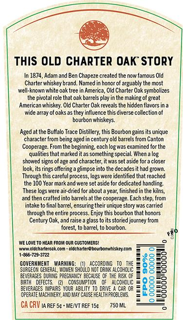
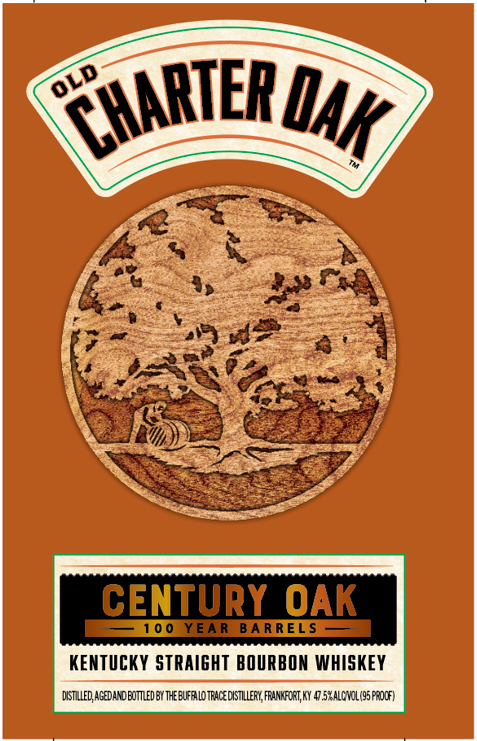

# TTB COLA Label Images - TTBID 26092001000346

**Brand Name:** OLD CHARTER OAK

**Fanciful Name:** 100 YEAR BARRELS

**Issue Date:** 04/03/2026

**Origin Code:** 22

**Product Class/Type:** 101

**Source:** [TTB Public COLA Registry](https://ttbonline.gov/colasonline/viewColaDetails.do?action=publicFormDisplay&ttbid=26092001000346)

## Label Images

### Back Label

### Front Label

### Label 2

## Extracted Label Text

*Text extracted via OCR - may contain errors*

*1 image(s) excluded: text did not meet readability threshold*

### Back Label

This OLD CHARTER OAK StoRY
In 1874, Adam and Ben Chapeze created the now famous Old
Charter whiskey brand. Named in honor of arguably the most
well-known white oak tree in America, Old Charter Oak symbolizes
the pivotal role that oak barrels play in the making of great
American whiskey: Old Charter Oak reveals the hidden flavors in a
wide array of oaksas they influence this diverse collection of
bourbon Whiskeys:
Agedat the Buffalo Trace Distillery; this Bourbon gains its unique
character from being aged in century old barrel
from Canton
Cooperage. From the beginning, each log was examined for the
qualities that marked it as something special
showed signs e
and character, it was set aside for 3 closer
pok, its
offering
glimpse into the decadesit had grown;
Through this
process,
ogs were identified that reached
the 100 Year mark and were set aside for dedicated handling:
These logs were air-dried for about ayear; finished in the kilns,
and then crafted into barrel
at the cooperage. Each step; from
intake
iinal barrel, ensuring their unrque story was carfied
through the entire process. Enjoy this bourbon that honors
Century Oak, and raise =
glass to its storied journey Irom
forest, to barrel to bourbon:
We LOvETO HEAR FROM Our CUSTOMERSI
wny olccharteroak con
clccharterebourtonwhiskeycom
1-865-729-3722
GOVERMMENT
WaRMIMG:
accordiG
T0   THE
88
SURGEOM GEMERAL, MMOWEM Should MDI C3 Wk alcdhclic
BEVERAG S DURIng PREGWAMCY BECAUSE
ThE RaSk OF
BRTH
DEFECTS
COMSUMPTION
AlcohDLIC
BEVERAGES WWPAIRS YOUR AB LITY T0 DRIVE
CAR 03
2
8
Operate MACHINERY, AWD Way CALSE HEALTHPROBLEWIS
CA CRV IA REF Sc ^ MENT REF 15c
750 ML
When &
ofage =
rings
careful

### Front Label

CENTURY OAK
100 YEAR
BA RREL $
KENTUCKY STRAIGHT BOURBON WHISKEY
DTEq Ageandeutledb/ TeelfA Lo TecE DYSTULLERL FeunnFCRUKY Q 5*AlCNIL/95prolf)
CHARTER
OLD
QAk
