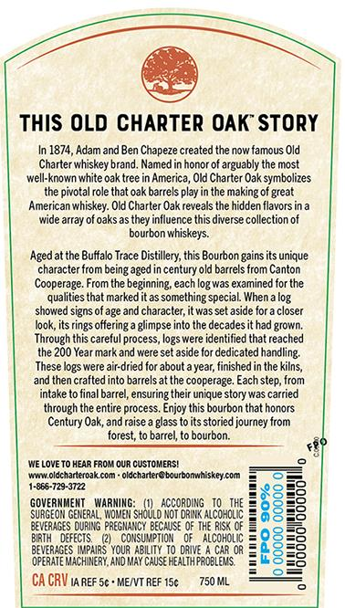
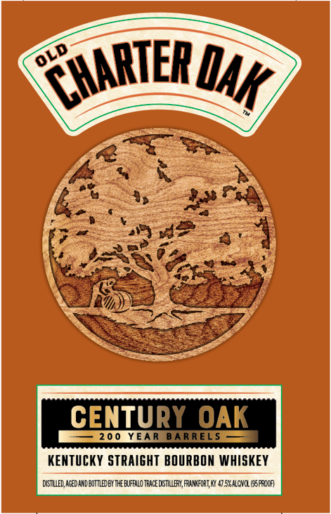

# TTB COLA Label Images - TTBID 26092001000356

**Brand Name:** OLD CHARTER OAK

**Fanciful Name:** 200 YEAR BARRELS

**Issue Date:** 04/03/2026

**Origin Code:** 22

**Product Class/Type:** 101

**Source:** [TTB Public COLA Registry](https://ttbonline.gov/colasonline/viewColaDetails.do?action=publicFormDisplay&ttbid=26092001000356)

## Label Images

### Back Label

### Front Label

### Label 3

## Extracted Label Text

*Text extracted via OCR - may contain errors*

*1 image(s) excluded: text did not meet readability threshold*

### Back Label

ThiS OLD CHARTER OAK' STORY
In 1874, Adam and Ben Chapeze created the now famous Old
Charter whiskey brand  Namedin honor of arguably the most
well-known white oak tree
America, Old Charter Oak symbolizes
the pivotal role that oak barrels play in the
making of great
American whiskey: Old Charter Oak reveals the hidden flavors in a
wide array of oaks as they influence this diverse collection of
bourbon whiskeys
Aged at the Buffal Trace Distillery; this Bourbon gains its unique
character from being aged in century old barrels from Canton
Cooperage. From the beginning; each log was examined for the
qualities that marked it as something special
When
showed signs of age and character;it was set aside for =
closer
Jook, itsrings
glimpse into the decades it had grown;
Through this careful process, logs were identilied that reached
the 200 Year mark and were set aside for dedicated handling:
These logs were air-dried for about ayear; finished in the kilns
and then crafted into barrels at the cooperage. Each step, from
intake to final barrel, ensuring the
unique story was carried
through the entire process: Enjoy this bourbon that honors
Century Oak, and raise
ass to its
storied journey from
forest; to barrel, to bourbon:
We Love T0 HEAR FROM OUR CUSTOMERSL
Ancoldchaderaakcot
olacharlere bourbommhiskeycoTI
1-865-729-3722
GOVERWMENT
Marwing:
according
ACoHCHE
8
82
SURGEOM GEMERAL , WOMEM Should KoT DRIAK
38
BEVERAGES
PREGHAMCY BECHUSE OF THE RUSK CF
3
BIRTH
DEFECTS,
CoWSUMPTIOM
alcoholic
BEVERAGES Impairs Your ABiliIy T0 DRIVE
Car OR
Ez
oferateMach MERY,AMD May ChuSE Fealthfadelews
=5
CA CRV IA REF Sc
MENVT REF 15c
750 ML
offering =
Durir

### Front Label

CENTURY OAK
200
YEAR
BARRELS
KENTUCKY STRAIGHT BOURBON WHISKEY
dKstied; ACEDARD BOTTLEDEx THE Euffalo TRACE CXSTLLERL, PrangForI Ky 4752 AlCNCL (95eroca
OLD
CHARTER
QAk
