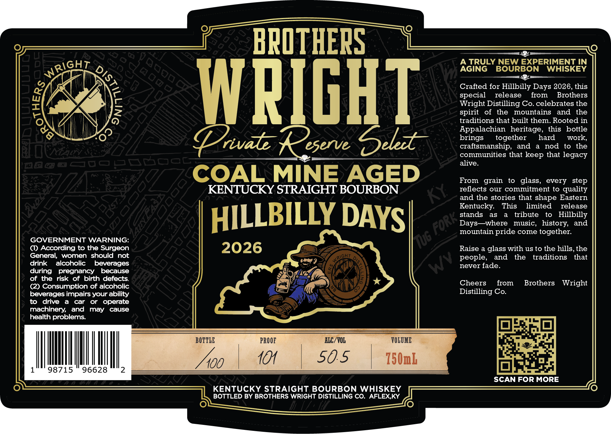

# TTB COLA Label Images - TTBID 26092001000449

**Brand Name:** BROTHERS WRIGHT

**Fanciful Name:** PRIVATE RESERVE SELECT

**Issue Date:** 04/03/2026

**Origin Code:** 22

**Product Class/Type:** 101

**Source:** [TTB Public COLA Registry](https://ttbonline.gov/colasonline/viewColaDetails.do?action=publicFormDisplay&ttbid=26092001000449)

## Label Images

### Label 1

## Extracted Label Text

*Text extracted via OCR - may contain errors*

### Label 1

BPOTHEPS
2
A TRULY NEW EXPERIMENT IN
8
AGING
BOURBON
WHISKEY
Crafted for Hillbilly Days 2026,this
1
WPIGHT
spegilat Diseleag Cooeleblaethene
(
spirit
of
the
mountains
and
the
traditions that built them. Rooted in
Appalachian  heritage,
this
bottle
Vrvat
eserve
Deledt
brangmansbgether
aarod
twolle
communities that keep that legacy
alive_
COAL MINE AGED
From   grain
to
glass
every
step
KENTUCKY STRAIGHT BOURBON
reflects our commitment to quality
and the stories that shape Eastern
Kentucky:
This
limited
release
HILLBILLY DAYS[
stands
as
tribute
to
Hillbilly
Days ~where
music,
history;
and
mountain pride come together:
GOVERNMENT WARNING:
(u6
(I) According to the Surgeon
2026
Raise a glass with uS to the hills,the
General;
women
should
not
people;
and
the
traditions
that
drink
alcoholic
beverages
never fade
during
pregnancy
because
of the
risk
of birth defects
(2) Consumption of alcoholic
Cheers
from
Brothers
Wright
beverages impairs your ability
Distilling Co_
to
drive
car
or
operate
machinery;
and
may
cause
health problems:
BOTTLE
PROOF
AIC/VOL
VOLOME
100
10
50.5
750mL
98715
96628
SCAN FOR MORE
KENTUCKY STRAIGHT BOURBON WHISKEY
BOTTLED BY BROTHERS WRIGHT DISTILLING CO.
AFLEX,KY
WRIGHT
DIS;
and
Fori ,
Wv
