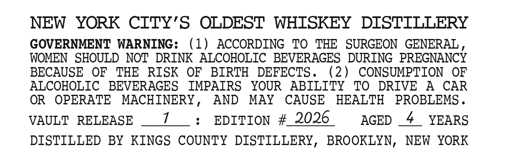
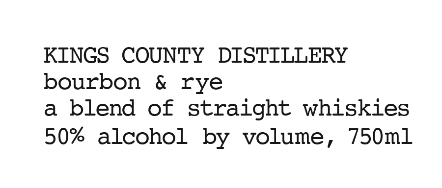

# TTB COLA Label Images - TTBID 26092001000589

**Brand Name:** KINGS COUNTY DISTILLERY

**Issue Date:** 05/13/2026

**Origin Code:** 02

**Product Class/Type:** 129

**Source:** [TTB Public COLA Registry](https://ttbonline.gov/colasonline/viewColaDetails.do?action=publicFormDisplay&ttbid=26092001000589)

## Label Images

### Back Label

### Label 1

## Extracted Label Text

*Text extracted via OCR - may contain errors*

**Detected Proof:** 100
**Detected Age:** 4 Years

### Back Label

NEW
YORK CTTY'S OLDEST WHTSKEY
DISTILLERY
GOVERNMENT WARNING:
(1)
ACCORDING
TO
THE   SURGEON
GENERAL
WOMEN   SHOULD NOT DRINK ALCOHOLIC
BEVERAGES
DURING  PREGNANCY
BECAUSE
OF
THE
RISK
OF
BIRTH
DEFECTS .
(2)
CONSUMPTION
OF
ALCOHOLIC
BEVERAGES
IMPATRS
YOUR
ABILITY
TO
DRIVE
A
CAR
OR
OPERATE
MACHINERY_
AND
MAY
CAUSE
HEALTH
PROBLEMS _
VAULT
RELEASE
EDITION
#
2026
AGED
4
YEARS
DISTILLED
BY
KINGS COUNTY
DISTILLERY,
BROOKLYN,
NEW  YORK

### Label 1

KINGS COUNTY DISTILLERY

bourbon & rye

a blend of straight whiskies

50% alcohol by volume, 750ml
