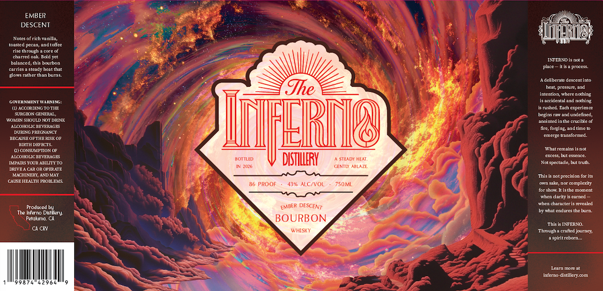

# TTB COLA Label Images - TTBID 26092001000786

**Brand Name:** THE INFERNO DISTILLERY

**Fanciful Name:** EMBER DESCENT

**Issue Date:** 04/08/2026

**Origin Code:** 01

**Product Class/Type:** 141

**Source:** [TTB Public COLA Registry](https://ttbonline.gov/colasonline/viewColaDetails.do?action=publicFormDisplay&ttbid=26092001000786)

## Label Images

### Label 1

### Label 2

## Extracted Label Text

*Text extracted via OCR - may contain errors*

**Detected Proof:** 86

### Label 1

EMBER
DESCENT
Foicoecicheanilln
ARn
tonstcd pecan; andtofce
Fcmrouch
cogo
chartdoak Ddd rt
Ihei 0 {nco
Caninncedenaneanmon
crdcrocadthcntthat
place
Ia procoe
Hort (allci Lidtl duouis_
aeclbltalc Ocsccnlinio
Jhe
heat; PrCssurc,end
Inlcoboll wacrcnolhing
TAncuentnenae
isacridcntal and nothing
AccurdirGt0 THR
Umuanco
ench crncacnc
Surc FoNGERRAA
brgims mawand undclintd,
TOYEI SHOULD NOl DMINK
Dnigintcdininecuriuc
^DCOHIOG FCRHEWEAAGES
FERL
andnlicio
cncir tansonnco:
RECMSRORTHR RIS KOr
BIRTH DEFECTS
CICONSUMPTION OP
Knnt gcmoing snd
WOHOUCBEUHAAGE
crccss, but csscnce.
BMEn
DSTHLLERY
SEADC HEA
IPaRS YOURARTTTTO
Fulsptcldc bultuut
CNTL
4riaze
DRIVRA CAR OR @PEUTE
MchirkxlANDKAl
Thisis notprccision for its
DlgtHEALH RrOgLrls
86 PROOF
ALCNVOL
750ML
Tnee
norcomplckl
I05 shox utastnc Mlonlcht
whcn dontte cntoco
Twhcn daracictisictcald
Rrodured
DESCENT
The Inatno
Dtiary
by whnt cndecsthc bum:
Petalur @
BOURBON
ThiiITEAFO
CCN
D2HSKY
Througha craflcd journcy
Dspliecbotn -
Ltim Iotc €
niemno
'distillcry com
fondor
EMBfR

### Label 2

THE INFERNO DISTILLERY THE INFERNO DISTILLERY
