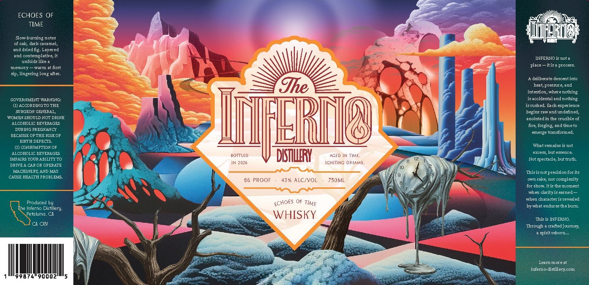

# TTB COLA Label Images - TTBID 26092001000791

**Brand Name:** THE INFERNO DISTILLERY

**Fanciful Name:** ECHOES OF TIME

**Issue Date:** 04/08/2026

**Origin Code:** 01

**Product Class/Type:** 140

**Source:** [TTB Public COLA Registry](https://ttbonline.gov/colasonline/viewColaDetails.do?action=publicFormDisplay&ttbid=26092001000791)

## Label Images

### Label 1

### Label 2

## Extracted Label Text

*Text extracted via OCR - may contain errors*

**Detected Proof:** 86

### Label 1

ECHOES OF
TIME
Slow-burning notes
oak; dark caramel;
and driedfig: Layered
and contemplative;
INFERNO is not a
unfolds like
place
itis
process
memory
warm at first
Sp:
lingering long after:
deliberate descent into
Ihe
pressure;
intention,wherenothing
GCVERNNENT WARNING:
is accidental andnothing
ACCCRDIGTOTHE
isrushed
Each experience
WONINGHDUEENO DRINK
IFERR
bapintedin hd undebleedi
ALCCHCLIC BEVERAGES
fire; forging and timeto
DURING FREGNANCY
emerge transfored
BECAUSE CF THE RISECF
BIRTH CEFECTS
CCNSUMFTICN CF
What remains is not
ALCCHCLIC BEVERAGES
e7ce55
but essence_
BOTTLED
DTHFRY
AGED JN TJME_
IMPAIRS YCUR ABILITY TC
Not spectacle; but truth:
JN 2026
JGMITING DREAMS
DRIVE
CR CR CPERATE
NACHINERE; AND NLAY
Thisisnot
precisionforits
CAUSE HEALTH PRCBLENS_
86 PROOF
43% ALCIVOL
750ML
own sake; nor complexity
for show Itis themoment
when clarity is earned
when characterisrevealed
Produced by
bywhat enduresthebur
The Inferno Distillery:
Petaluma, CH
WHISKY
This is IFERNO.
Ch CRV
Through
craftedjourey;
spirit reborn _
Lear more at
inferno-distillerycom
heat;
and
ECHOES
TIME

### Label 2

THE INFERNO DISTILLERY
THE INFERNO
DISTILLERY
