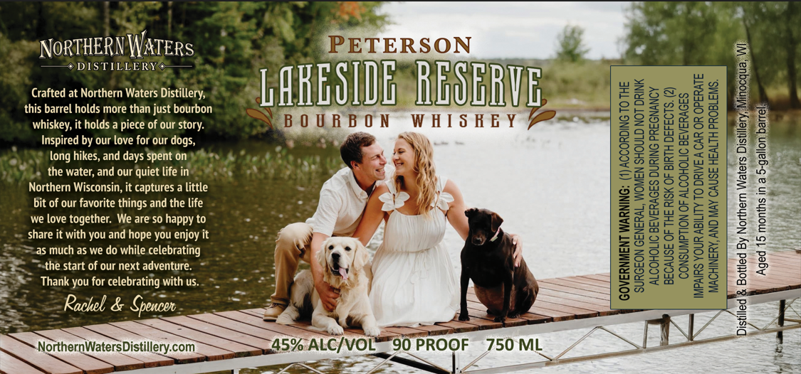

# TTB COLA Label Images - TTBID 26092001000820

**Brand Name:** PETERSON LAKESIDE RESERVE

**Issue Date:** 04/06/2026

**Origin Code:** 48

**Product Class/Type:** 141

**Source:** [TTB Public COLA Registry](https://ttbonline.gov/colasonline/viewColaDetails.do?action=publicFormDisplay&ttbid=26092001000820)

## Label Images

### Label 1

## Extracted Label Text

*Text extracted via OCR - may contain errors*

**Detected Proof:** 90

### Label 1

S

NORTHERN WATERS +

DISTILLERY ©

ie

Crafted at Northern Waters Distillery,

CARE SID

OER

S

this barrel holds more than just bourbon

whiskey, it holds a piece of our story.

BOURBON

WHISHEY

S

Inspired by our love for our dogs,

om

long hikes, and days Spent on

ee

the water, and our Quiet life in

oe

Northern Wisconsin, it captures a little

o

———

bit of our favorite things and the life

we love together. We are so happy to

share it with you and hope you enjoy it

as much as we do while celebrating

fa /

the start of our next adventure.

<2

“SS Thank you for celebratinig with us.

Reclel 5 Gnsoe

NorthernWaters|

45%: ALC/VOL— 90 PROOF 750 ML

DN
