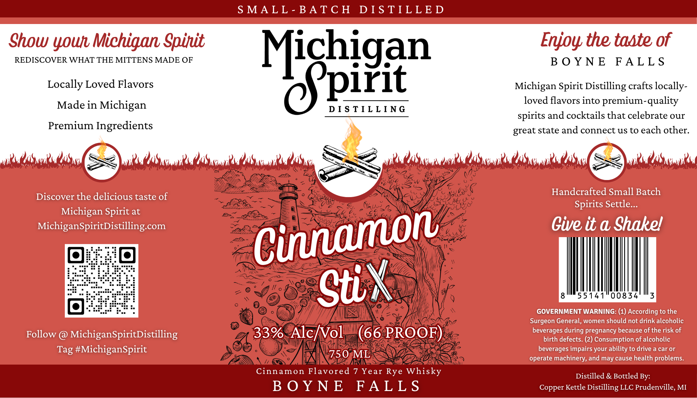

# TTB COLA Label Images - TTBID 26092001000932

**Brand Name:** MICHIGAN SPIRIT DISTILLING

**Fanciful Name:** CINNAMON STIX

**Issue Date:** 04/06/2026

**Origin Code:** 06

**Product Class/Type:** 149

**Source:** [TTB Public COLA Registry](https://ttbonline.gov/colasonline/viewColaDetails.do?action=publicFormDisplay&ttbid=26092001000932)

## Label Images

### Label 1

## Extracted Label Text

*Text extracted via OCR - may contain errors*

**Detected Proof:** 66
**Detected Age:** 7 Years

### Label 1

S MALL - BATC H
D I S TILL E D
Show
Michigan Spinit
Enjoy the taste of
REDISCOVER WHAT THE MITTENS MADE OF
B 0 Y N E
FAL L S
Locally Loved Flavors
Nicpigan
Michigan Spirit Distilling crafts locally-
Made in
Michigan
loved flavors into premium-quality
D I S TIL L ING
spirits and cocktails that celebrate our
Premium Ingredients
state and connect us to each other:
Mms OaSul OaSa
Kuwal
"S Kkwnl2"7Vww)
OaS Kon(
Wns /4S Kopilu
Discover the delicious taste of
Handcrafted Small Batch
Spirits Settle.
Michigan Spirit at
MichiganSpiritDistilling com
Give it a Shakel
55141"00834
3
GOVERNMENT WARNING: (1) According to the
Surgeon General, women should not drink alcoholic
Follow
MichiganSpiritDistilling
33%
Alc/Vol
(66 PROOF)
beverages during pregnancy because of the risk of
birth defects- (2) Consumption of alcoholic
Tag #MichiganSpirit
beverages impairs your ability to drive a car or
750 ML
operate machinery; and may cause health problems_
Imal
Cinnamon Flavored
7 Year
Rye Whisky
Distilled & Bottled By:
B 0 Y N E
FA L L S
Copper Kettle Distilling LLC Prudenville, MI
QOWhl
great
Nala
Mia ,
Cinamon
StiX
