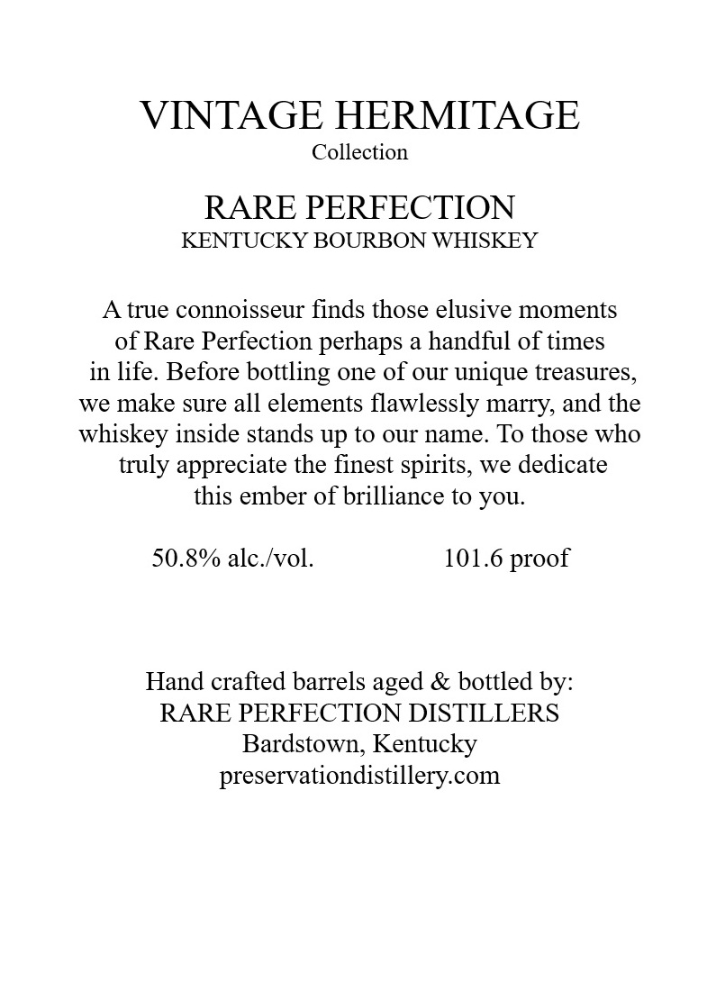
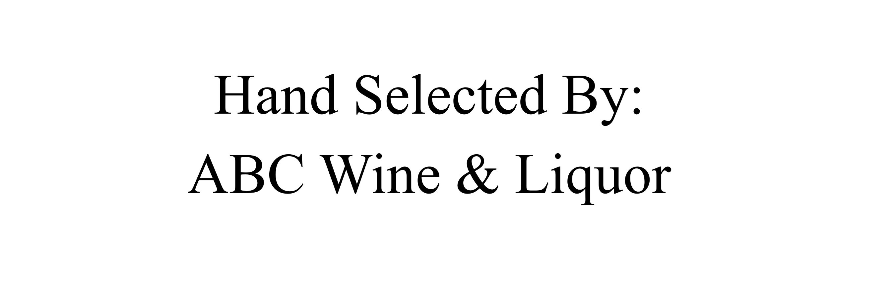

# TTB COLA Label Images - TTBID 26092001001000

**Brand Name:** RARE PERFECTION

**Issue Date:** 04/06/2026

**Origin Code:** 22

**Product Class/Type:** 141

**Source:** [TTB Public COLA Registry](https://ttbonline.gov/colasonline/viewColaDetails.do?action=publicFormDisplay&ttbid=26092001001000)

## Label Images

### Back Label

### Label 1

### Label 3

### Label 4

### Label 5

## Extracted Label Text

*Text extracted via OCR - may contain errors*

**Detected Proof:** 101.6

### Back Label

Privileged to introduce this
exceptional bottle of rare
Kentucky Bourbon Whiskey,
Vintage Cask; unfiltered,
Cask strength: Rare
Perfection. True to our
namesake, every miniscule
lot and odd barrel hand
selected at optimum age
and
Share our
treasures as we find them
and enjoy some of the rarest
most remarkable whiskey:
Every lot no matter nationality
chosen for uncommon character;
rough elegance, and
long-lasting smack in the
finish; leaving even the
cynical drinker shaking his
head, asking for another pour:
Enjoy!
proof:

### Label 1

VINTAGE HERMITAGE
Collection
RARE PERFECTION
KENTUCKY BOURBON WHISKEY
true connoisseur finds those elusive moments
of Rare Perfection perhaps a handful of times
in life. Before bottling one of OUr unique treasures,
we make sure all elements flawlessly marry, and the
whiskey inside stands up to our name
To those who
truly appreciate the finest spirits, we dedicate
this ember of brilliance to you
50.8% alc_Ivol.
101.6
Hand crafted barrels
& bottled by:
RARE PERFECTION DISTILLERS
Bardstown, Kentucky
preservationdistillery.com
proof
aged

### Label 3

RARE PERFECTION

YEARS 10 OLD

KENTUCK URBON WHISKEY

### Label 4

GOVERNMENT WARNING:
ACCORDING
TO
THE
SURGEON
GENERAL
INGmEr) AGOBD8
NOT
DRINK
AicoHoLic
BEVERAGES
DURiNG
PREGNANCY
BECAUSE
OF
THE
RISK
OF
BIRTH
DEFFECTS
2
CONSUMpTION
OF
Alcohoic
BEVERAGES
IMPAIRS
YOUR
ABILITY
TO
DRIVE
A
CAR
OR
OPERATE
MACHINERY
And
MAY
CAUSE
UPC - FOR POSITION ONLY
HeALTH
PROBLEMS:
750ml

### Label 5

Hand Selected By:

ABC Wine & Liquor
