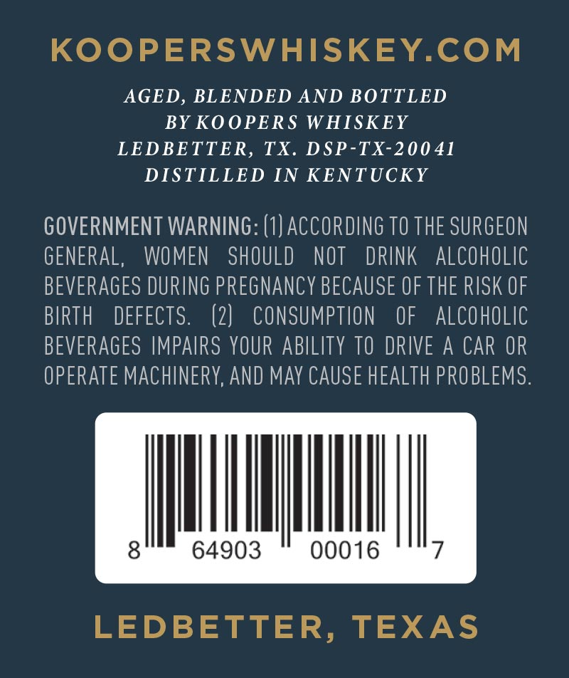
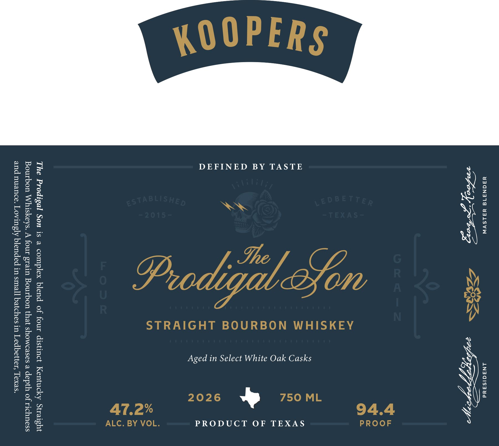

# TTB COLA Label Images - TTBID 26092001001032

**Brand Name:** KOOPERS

**Fanciful Name:** THE PRODIGAL SON

**Issue Date:** 04/06/2026

**Origin Code:** 22

**Product Class/Type:** 101

**Source:** [TTB Public COLA Registry](https://ttbonline.gov/colasonline/viewColaDetails.do?action=publicFormDisplay&ttbid=26092001001032)

## Label Images

### Back Label

### Label 1

## Extracted Label Text

*Text extracted via OCR - may contain errors*

### Back Label

KOOPERSWHISKEY.COM

AGED, BLENDED AND BOTTLED

BY KOOPERS WHISKEY

LEDBETTER, TX. DSP-TX-20041

DISTILLED IN KENTUCKY

GOVERNMENT WARNING: (1) ACCORDING TO THE SURGEON

GENERAL, WOMEN SHOULD NOT DRINK ALCOHOLIC

BEVERAGES DURING PREGNANCY BECAUSE OF THE RISK OF

BIRTH DEFECTS

(2) CONSUMPTION OF ALCOHOLIC

BEVERAGES IMPAIRS YOUR ABILITY TO DRIVE A CAR OR

OPERATE MACHINERY, AND MAY CAUSE HEALTH PROBLEMS

WM

64903

00016

7

LEDBETTER, TEXAS

### Label 1

YS0N3519 YALSVW LNadIsadd

Se eae) AGP IY

DEFINED BY TASTE
Aged in Select White Oak Casks
PRODUCT OF TEXAS

The Prodigal Son is a complex blend of four distinct Kentucky Straight
Bourbon Whiskeys. A four grain Bourbon that showcases a depth of richness
and nuance. Lovingly blended in small batches in Ledbetter, Texas.
