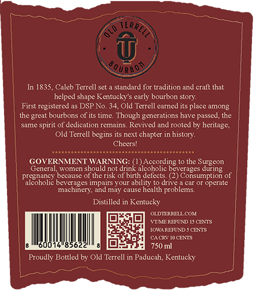
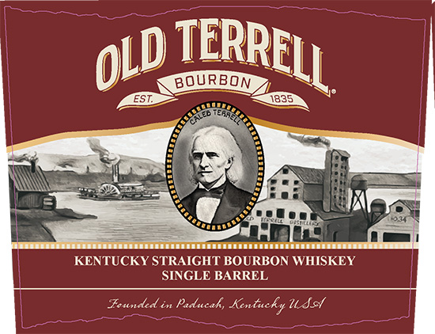
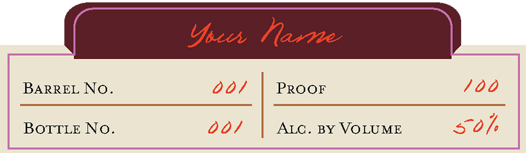

# TTB COLA Label Images - TTBID 26093001000099

**Brand Name:** OLD TERRELL

**Fanciful Name:** SINGLE BARREL

**Issue Date:** 04/08/2026

**Origin Code:** 22

**Product Class/Type:** 101

**Source:** [TTB Public COLA Registry](https://ttbonline.gov/colasonline/viewColaDetails.do?action=publicFormDisplay&ttbid=26093001000099)

## Label Images

### Back Label

### Label 1

### Label 2

## Extracted Label Text

*Text extracted via OCR - may contain errors*

### Back Label

8oURBos
In 1835, Caleb Terrell sct _
standard for tradition and cralt that
helped shape Kentucky' $ early bourbon story:
First registered as DSP No.34,Old Terrell earned its place among
the great bourbons of its time. Though generations have passed, the
same spirit of dedication remains Revived and rooted by heritage,
Old Terrell begins its next chapter in history.
Cheers'
GOVERMMENT WARNING:
According to the Surgeon
General, women should not drink alcoholic beverages during
pregnancy because
the risk of birth defects (2) Consumption of
coholic bevcrages Impatrs youI
ability
to drive
car Or operale
machinery; and may cause health problems.
Distilled in Kentucky
OLDIERRELL COM
WTAERHUND IS CENTS
IOWARFFAT
CEATS
CACRIo Che
750 ml
Proudly Boltled by Old Terrell in Paducah, Kentucky
TERREL

### Label 1

BOURBON
1835
KENTUCKY STRAIGHT BOURBON WHISKEY
SINGLE BARREL
founded in Paducah,
Kentucky USst
TERRELL
OLD

### Label 2

Ysun Marne
BARREL No_
001
PRooF
1 00
BOTTLE No.
00/
ALC .
BY VoLUME
s707
