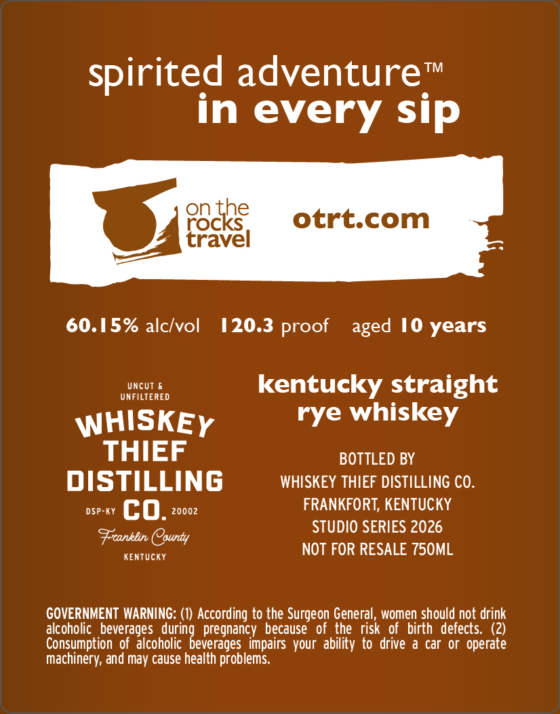
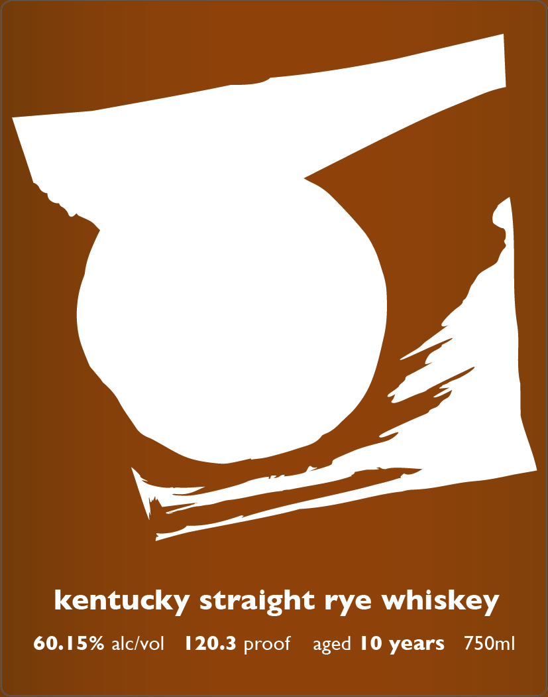

# TTB COLA Label Images - TTBID 26093001000136

**Brand Name:** WHISKEY THIEF DISTILLING CO.

**Issue Date:** 04/07/2026

**Origin Code:** 22

**Product Class/Type:** 102

**Source:** [TTB Public COLA Registry](https://ttbonline.gov/colasonline/viewColaDetails.do?action=publicFormDisplay&ttbid=26093001000136)

## Label Images

### Back Label

### Front Label

## Extracted Label Text

*Text extracted via OCR - may contain errors*

**Detected Proof:** 120.3
**Detected Age:** 10 Years

### Back Label

spirited adventure
TM
in every sip
on the
rocks
otrt.com
travel
60.15% alclvol
20.3
10 years
UncUT &
kentucky straight
UNFILTERED
WHISKEY
rye whiskey
THIEF
BOTTLED BY
DISTILLING
WHISKEY THIEF DISTILLING CO.
DSP-KY
co:
20002
FRANKFORT, KENTUCKY
STUDIO SERIES 2026
Frcanklin Oounty
KenTUcKY
NOT FOR RESALE 750ML
GOVERNMENT WARNING:
According to the Surgeon General , women should not drink
alcoholic   beverages
pregnancy
because   of the   risk
of   birth  defects: (2)
Consumption   of  alcoholic
impairs  your ability to drive
a car Or  operate
machinery; and may cause health problems
proof
aged
durindbeverages

### Front Label

kentucky straight rye whiskey
60.15% alclvol
20.3 proof
10 years
750ml
aged
