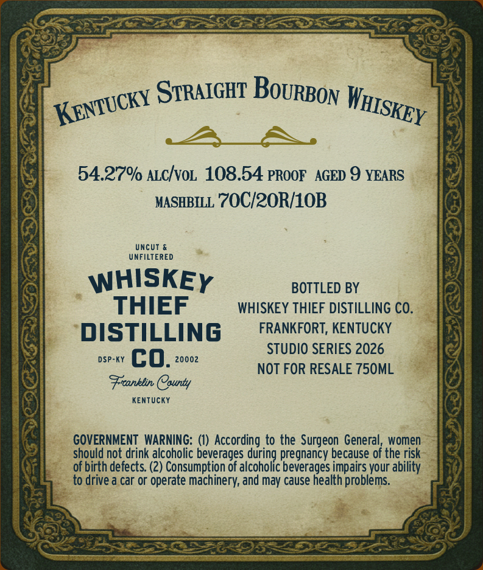
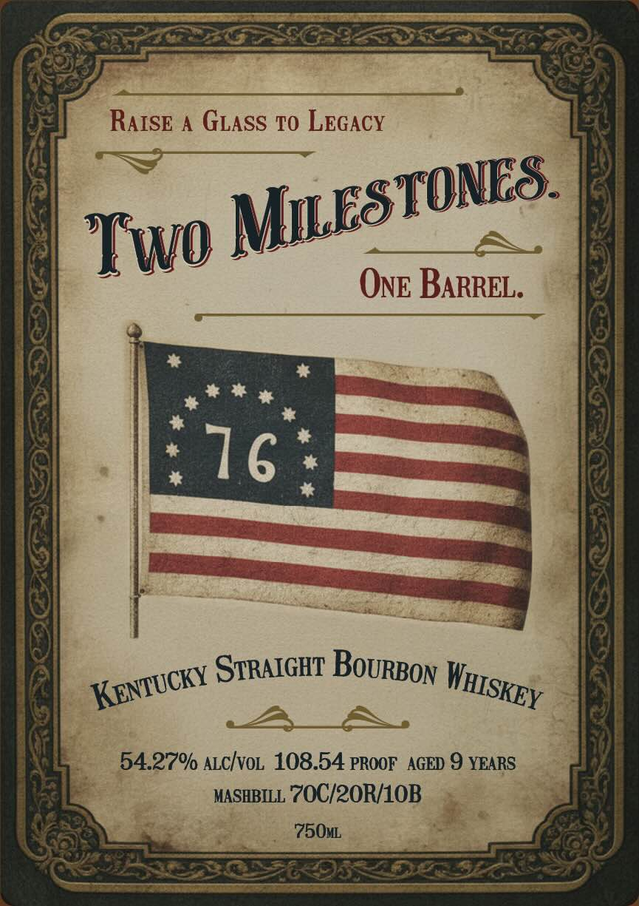

# TTB COLA Label Images - TTBID 26093001000138

**Brand Name:** WHISKEY THIEF DISTILLING CO.

**Fanciful Name:** TWO MILESTONES

**Issue Date:** 04/06/2026

**Origin Code:** 22

**Product Class/Type:** 101

**Source:** [TTB Public COLA Registry](https://ttbonline.gov/colasonline/viewColaDetails.do?action=publicFormDisplay&ttbid=26093001000138)

## Label Images

### Back Label

### Front Label

## Extracted Label Text

*Text extracted via OCR - may contain errors*

**Detected Proof:** 108.5
**Detected Age:** 9 Years

### Back Label

STRAIGHT
54.27% ALcIvoL 108.54 PROOF   AGED 9 YEARS
MASHBILL
70C/20R/1OB
UncUt
UNFILTERED
WHISKEY
BOTTLED BY
THIEF
WHISKEY THIEF DISTILLING CO.
DISTILLING
FRANKFORT, KENTUCKY
STUDIO SERIES 2026
DSP-KY
co.
20002
NOT FOR RESALE 750ML
Frcanklin County
KENTUCKY
GOVERNMENT WARNING:
According.to the Surgeon General;
women
should not drink alcoholic beverages during pregnancy because of the risk
of birth defects (2) Consumption of alcoholic beverages impairs your ability
to drive a car or operate machinery; and may cause health problems_
BoURBON
WHISKEY
KENTUCKY

### Front Label

RAISE
A
GLASS TO LEGACY
Two
OnE BARREL.
STRAIGHT
54.27% ALcIvoL 108.54 PROOF   AGED 9 YEARS
MASHBILL 7OC/2OR/1OB
750ML
MILESTONES.
16
BoURBON
WHISKEY
KENTUCKY
