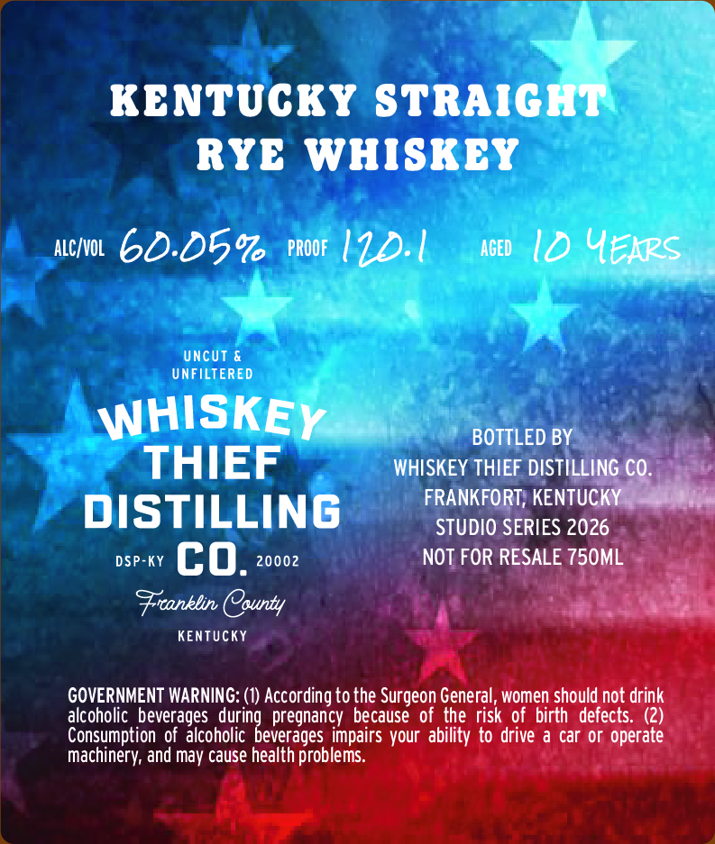
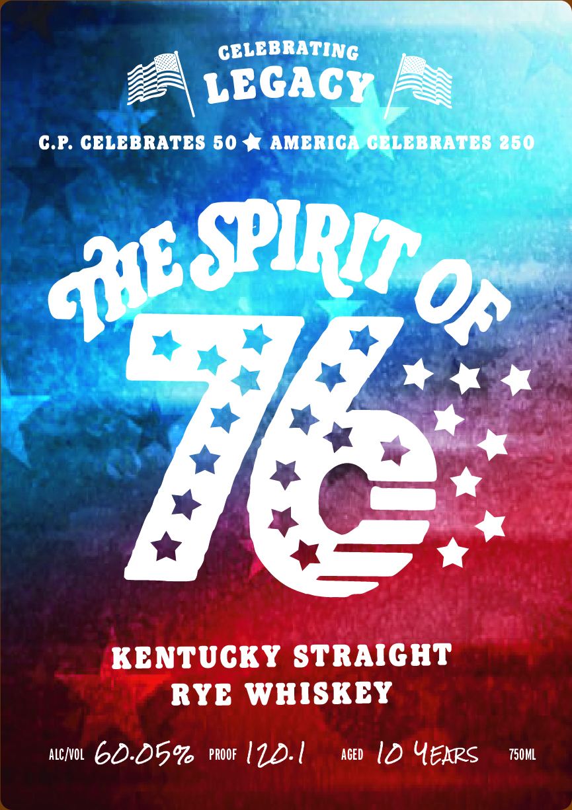

# TTB COLA Label Images - TTBID 26093001000140

**Brand Name:** WHISKEY THIEF DISTILLING CO.

**Issue Date:** 04/07/2026

**Origin Code:** 22

**Product Class/Type:** 102

**Source:** [TTB Public COLA Registry](https://ttbonline.gov/colasonline/viewColaDetails.do?action=publicFormDisplay&ttbid=26093001000140)

## Label Images

### Back Label

### Front Label

## Extracted Label Text

*Text extracted via OCR - may contain errors*

**Detected Proof:** 120.1

### Back Label

KENTUCKY STRAIGHT
RYE WHISKEY
ALCKVOL
60.05%
PROOF
I.1
ACED
Id Uekps
UncUT &
UNFILTERED
WHISKEY
BOTTLED BY
THIEF
WHISKEY THIEF DISTILLING CO.
FRANKFORT; KENTUCKY
DISTILLING
STUDIO SERIES 2026
DSP-KY
co.
20002
NOT FOR RESALE 750ML
Frcanklin COounty
KEnTUCKY
GOVERNMENT WARNING: (1) According to the Surgeon General , women should not drink
alcoholic   beverages
pregnancy because of,the risk of birth  defects: (2)
Consumption of  alcoholic
impairs your ability to drive & car or operate
Machinery; and may cause health problems:
dorindevceages

### Front Label

CELEBRATING
LEGACY
C.P: CELEBRATES 50
AMERICA CELBBRATES 250
SPIRIT
KENTUCKY STRAIGHT
RYE WHISKEY
ALCNOL
60-054
PROOF
I1.1
AgeD
I0 Uekps
750ML
@uL
OF
