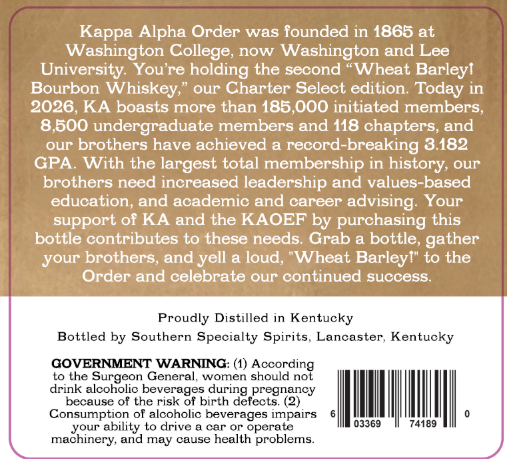
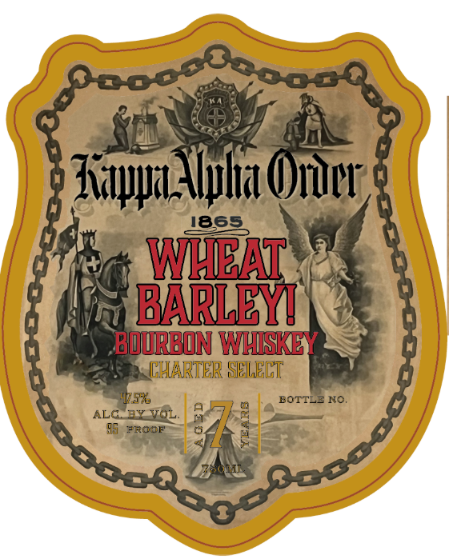
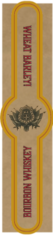

# TTB COLA Label Images - TTBID 26093001000248

**Brand Name:** KAPPA ALPHA ORDER

**Issue Date:** 04/06/2026

**Origin Code:** 22

**Product Class/Type:** 141

**Source:** [TTB Public COLA Registry](https://ttbonline.gov/colasonline/viewColaDetails.do?action=publicFormDisplay&ttbid=26093001000248)

## Label Images

### Back Label

### Front Label

### Label 3

## Extracted Label Text

*Text extracted via OCR - may contain errors*

*1 image(s) excluded: text did not meet readability threshold*

### Back Label

Kappa Alpha Order was founded in 1865 at
Washington College
now
Washington and Lee
University. Youre holding the second
Wheat Barleyl
Bourbon
Whiskey;
our Charter Select edition
Today in
2026,KA boasts more than 185,000 initiated members
8,500 undergraduate members and 118 chapters; and
our brothers have achieved & record
breaking 3.182
GPA
With the largest total membership in
our
brothers need increased leadership and values-based
education; and academic and
career
advising
Your
support of KA and the KAOEF by purchasing this
bottle contributes to these needs
Grab a bottle
your brothers
and
a loud;" Wheat Barleyl" to the
Order and celebrate
our continued success
Proudly Distilled in Kentucky
Bottled by Southern Specialty Spirits.
Lancaster Kentucky
GOVERNMENT WARNING: (1)
ccorcing
Lo Lhe
Surgeon General,
WOMCI
should nol
drink alcoholic beverages during pregnancy
because of the risk of birth defects: (2)
Consumption
Olaiconolc
peverages Impairs
vour
ability to drive
operate
03369
74169
machinery, and may cause heallh problems
history
gather
yell

### Front Label

8ooooocoooq
Ziauu_ Ilia Oiuur ,{
4865
WBAT
BARLEY
BOJRRBON WHISKEY
GHARTER SHLELT
45u
BOTTLE No_
ALG
3
7R0OF
Qoq
ZRoM
050300
