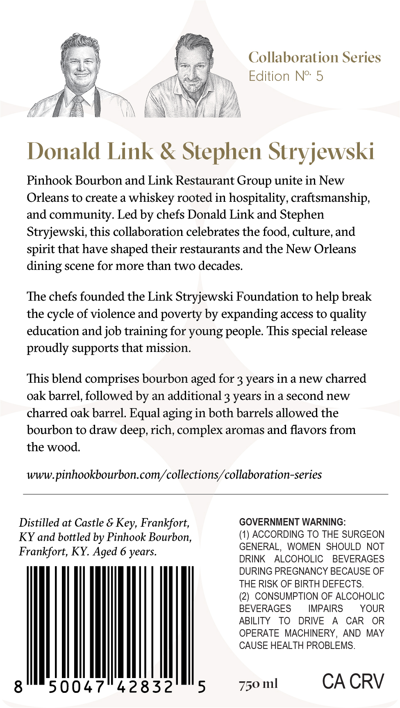
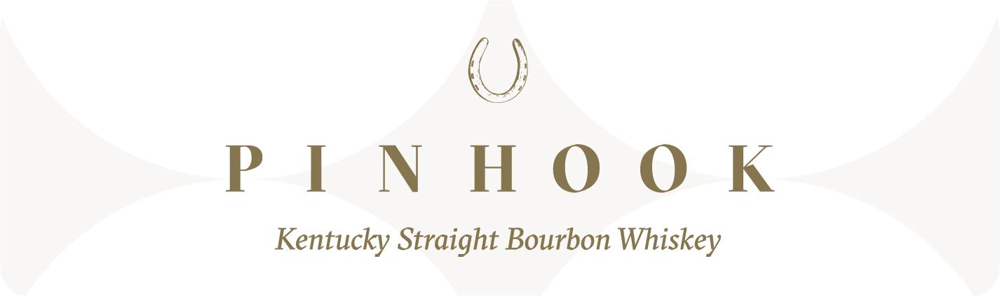

# TTB COLA Label Images - TTBID 26093001000262

**Brand Name:** PINHOOK

**Fanciful Name:** COLLABORATION SERIES

**Issue Date:** 04/06/2026

**Origin Code:** 22

**Product Class/Type:** 101

**Source:** [TTB Public COLA Registry](https://ttbonline.gov/colasonline/viewColaDetails.do?action=publicFormDisplay&ttbid=26093001000262)

## Label Images

### Back Label

### Front Label

## Extracted Label Text

*Text extracted via OCR - may contain errors*

**Detected Age:** 3 Years

### Back Label

Collaboration Series

Edition N° 5

A

f

L

Donald Link & Stephen Stryjewski

Pinhook Bourbon and Link Restaurant Group unite in New

Orleans to create a whiskey rooted in hospitality, craftsmanship,

and community. Led by chefs Donald Link and Stephen

Stryjewski, this collaboration celebrates the food, culture, and

spirit that have shaped their restaurants and the New Orleans

dining scene for more than two decades.

The chefs founded the Link Stryjewski Foundation to help break

the cycle of violence and poverty by expanding access to quality

education and job training for young people. This special release

proudly supports that mission.

This blend comprises bourbon aged for 3 years in a new charred

oak barrel, followed by an additional 3 years in a second new

charred oak barrel. Equal aging in both barrels allowed the

bourbon to draw deep, rich, complex aromas and flavors from

the wood.

www.pinhookbourbon.com/collections/collaboration-series

Distilled at Castle & Key, Frankfort,

GOVERNMENT WARNING:

(1) ACCORDING TO THE SURGEON

KY and bottled by Pinhook Bourbon,

GENERAL, WOMEN SHOULD NOT

Frankfort, KY. Aged 6 years.

DRINK ALCOHOLIC BEVERAGES

DURING PREGNANCY BECAUSE OF

THE RISK OF BIRTH DEFECTS.

(2) CONSUMPTION OF ALCOHOLIC

BEVERAGES

IMPAIRS

YOUR

ABILITY TO DRIVE A CAR OR

OPERATE MACHINERY, AND MAY

CAUSE HEALTH PROBLEMS.

NAMI

50 ml

CA CRV

### Front Label

PINHOOK
Kentucky Straight Bourbon Whiskey
