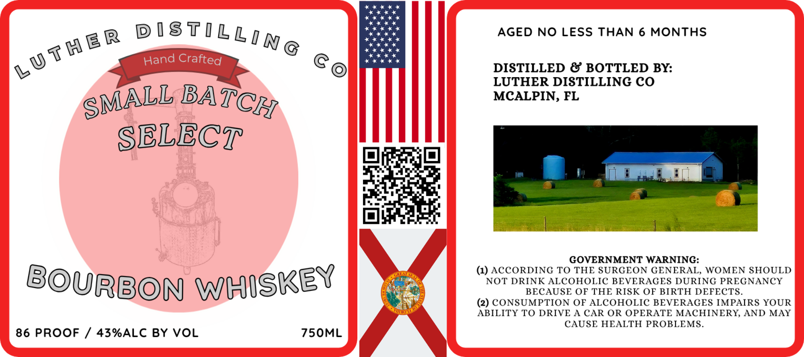

# TTB COLA Label Images - TTBID 26093001000276

**Brand Name:** LUTHER DISTILLING CO

**Issue Date:** 04/06/2026

**Origin Code:** 16

**Product Class/Type:** 141

**Source:** [TTB Public COLA Registry](https://ttbonline.gov/colasonline/viewColaDetails.do?action=publicFormDisplay&ttbid=26093001000276)

## Label Images

### Label 1

## Extracted Label Text

*Text extracted via OCR - may contain errors*

**Detected Proof:** 86

### Label 1

AGED NO LESS THAN 6 MONTHS
Crafted
DISTILLED & BOTTLED BY:
LUTHER DISTILLING CO
BA_
MCALPIN, FL
SELECT
GOVERNMENT WARNING:
(1) ACcORDING TO THE SURGEON GENERAL, WOMEN SHOULD
BOURBON
NOT DRINK ALCOHOLIC BEVERAGES DURING PREGNANCY
BECAUSE OF THE RISK OF BIRTH DEFECTS_
(2) CONSUMPTION OF ALCOHOLIC BEVERAGES IMPAIRS YOUR
ABILITY TO DRIVE A CAR OR OPERATE MACHINERY, AND MAY
CAUSE HEALTH PROBLEMS
86 PROOF
43%ALC BY VOL
75OML
D IST ILLI N G
L u ThER
Hand
SMALL
TCH
WhISKEY
