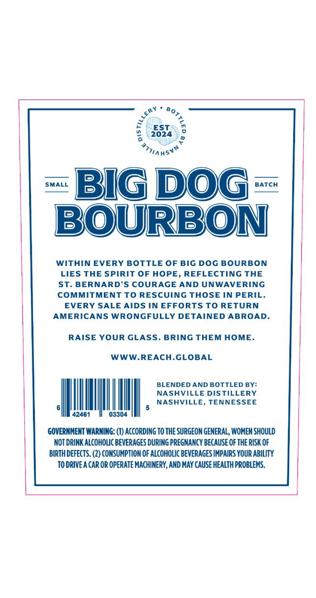
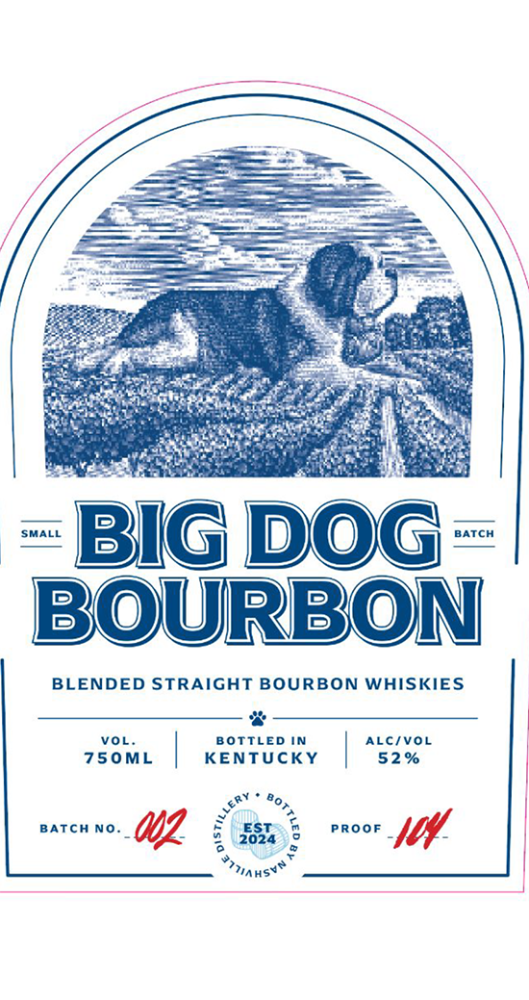

# TTB COLA Label Images - TTBID 26093001000280

**Brand Name:** BIG DOG BOURBON

**Issue Date:** 04/06/2026

**Origin Code:** 43

**Product Class/Type:** 121

**Source:** [TTB Public COLA Registry](https://ttbonline.gov/colasonline/viewColaDetails.do?action=publicFormDisplay&ttbid=26093001000280)

## Label Images

### Back Label

### Front Label

## Extracted Label Text

*Text extracted via OCR - may contain errors*

### Back Label

WITHIN EVERY BOTTLE OF BIG DOG BOURBON
LIES THE SPIRIT OF HOPE, REFLECTING THE
ST. BERNARD'S COURAGE AND UNWAVERING
COMMITMENT TO RESCUING THOSE IN PERIL.
EVERY SALE AIDS IN EFFORTS TO RETURN
AMERICANS WRONGFULLY DETAINED ABROAD.

RAISE YOUR GLASS. BRING THEM HOME.

42461 03304

GOVERNMENT WARNING: (1) ACCORDING T0 THE SURGEON GENERAL, WOMEN SHOULD
NOT DRINK ALCOHOLIC BEVERAGES DURING PREGNANCY BECAUSE OF THE RISK OF
BIRTH DEFECTS. (2) CONSUMPTION OF ALCOHOLIC BEVERAGES IMPAIRS YOUR ABILITY
TODRIVE A CAR OR OPERATE MACHINERY, AND MAY CAUSE HEALTH PROBLEMS.

WWW.REACH.GLOBAL

NASHVILLE DISTILLERY

BLENDED AND BOTTLED BY:
5 NASHVILLE, TENNESSEE

### Front Label

SS
, ha
= en
SSS Sy a
SSS ee
Aetisge, ee 7 i oe *
iS ae. SSR nce sr Ween
in Pee oes C = eS ae
tae <a Pe gece
are ai El pee Mega = Ta aa
Se ts 2S rien a =, oe
SS eRe AC Se
1 pO phe aR eas
a taiat ENS Sine gee c=
‘SMALL im BATCH
a 2 ——
=) 2)
>) i)
BLENDED STRAIGHT BOURBON WHISKIES
J si
vou. BOTTLED IN ALC/VoL
750ML | KENTUCKY 52% |
wee 80,
VA 2 *
earcn no. Uf ; EST 8 root [ff
Qa
|
