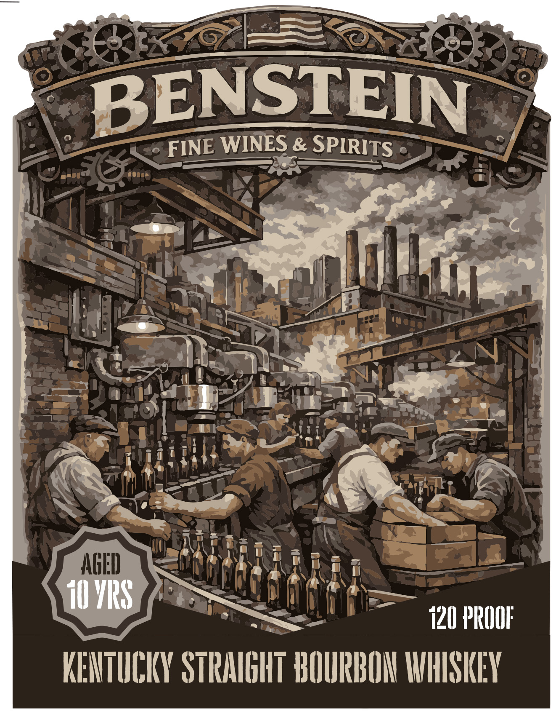
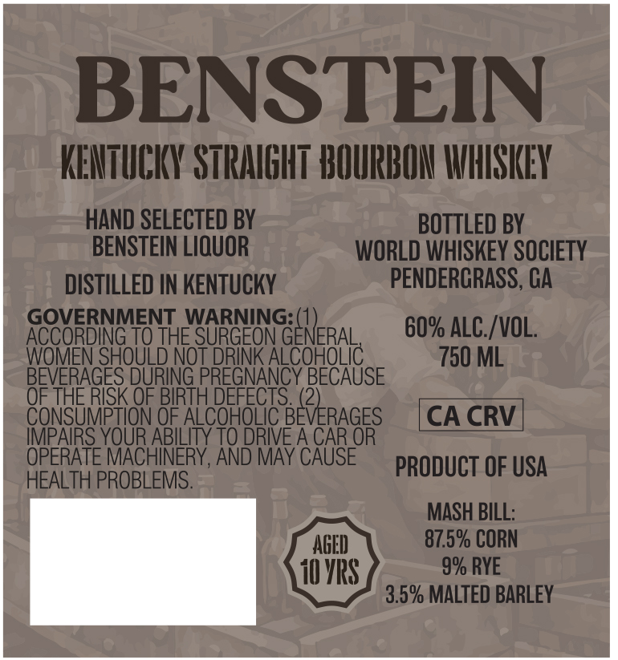

# TTB COLA Label Images - TTBID 26093001000305

**Brand Name:** BENSTEIN

**Issue Date:** 04/06/2026

**Origin Code:** 22

**Product Class/Type:** 101

**Source:** [TTB Public COLA Registry](https://ttbonline.gov/colasonline/viewColaDetails.do?action=publicFormDisplay&ttbid=26093001000305)

## Label Images

### Back Label

### Front Label

## Extracted Label Text

*Text extracted via OCR - may contain errors*

**Detected Proof:** 120

### Back Label

BENSTEIN
FINE WINES & SPIRITS
AGED
I0 VIRS
120 PROOF:
KEMTICIY STRMIGHT BOUPRBOU IHHISKEY

### Front Label

BENSTEIN
KENTUCKY STRAIGHT HOURIOH IHISKEY
HAND SELECTED BY
BOTTLED BY
BENSTEIN LIQUOR
WORLD WhISKeY SOCIETY
DISTILLED IN KENTUCKY
PENDERGRASS, GA
GOVERNMENT WARNING:(1)
ACCORDING TO THE SURGEON GENERAL
60% ALC /VOL;
WOMEN SHOULD NoT DRINK ALCOHOLIC
750 ML
BEVERAGES DURING PREGNANCY BECAUSE
OF THE RISK OF BIRTH DEFECTS (2)
CONSUMPTION OF ALCOHOLIC BEVERAGES
CA CRV
IMPAIRS YOUR ABILITY TO DRIVE A CAR OR
OPERATE MACHINERY, AND MAY CAUSE
PRODUCT OF USA
HEALTH PROBLEMS.
MASH BILL:
AGED
87.5% CORN
10 VIS
9% RYE
3.5% MALTED BARLEY
