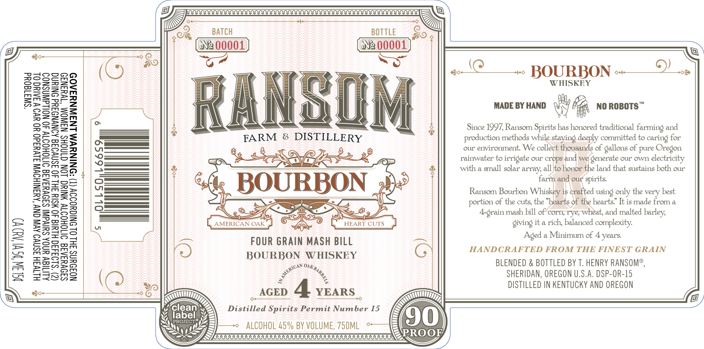

# TTB COLA Label Images - TTBID 26093001000370

**Brand Name:** RANSOM FARM & DISTILLERY

**Issue Date:** 04/06/2026

**Origin Code:** 38

**Product Class/Type:** 141

**Source:** [TTB Public COLA Registry](https://ttbonline.gov/colasonline/viewColaDetails.do?action=publicFormDisplay&ttbid=26093001000370)

## Label Images

### Label 1

## Extracted Label Text

*Text extracted via OCR - may contain errors*

**Detected Age:** 4 Years

### Label 1

o
iS
i

BATCH BOTTLE
NE 00001 NB 00001

B
«!@___.. BOURBON +9)

WHISKEY

MADE BY HAND wy he NO ROBOTS™

Since 1997, Ransom Spirits has honored traditional farming and
production methods while staying deeply committed to caring for
our environment. We collect thousands of gallons of pure Oregon

rainwater to irrigate our crops and we generate our own electricity
with a small solar array, all)to honor the land that sustains both our
farm and our spirits.

“SWI180Ud

Ransom Bourbon Whiskey is Grafted using only the very best
portion of the cuts, the "hearts of the hearts” It is made from a
A-geain mash bill of’corn, rye, wheat, and malted barley,
Giving it a rich, balanced complexity.

Aged a Minimum of 4 years.
HANDCRAFTED FROM THE FINEST GRAIN

BLENDED & BOTTLED BY T. HENRY RANSOM®,
SHERIDAN, OREGON U.S.A. DSP-OR-15
DISTILLED IN KENTUCKY AND OREGON

FOUR GRAIN MASH BILL
BOURBON WHISKEY

Roy

ALITIGY UNOA SUIYdINI S39VYIAIS OITOHOITY 40 NOLLdWASNOD
(2) $1933 HLUI 40 WSIY SHL 40 3SNVO3E AONYNDIYd ONIUNG
SAOVYIAIG OTOHODTY NING LON CTNOHS NSWOM “IW43NI9
NO3OYNS FHL OL ONIGYODOV (1) *DNINYWM LNAWNYSA09

HITW3H 3SNVO AV ONY ‘AMANIHOVIN JUVY3d0 YO YO W 3AINC OL

NOLIN ISH ADD

AA
eg

AGED 4 YEARS
Feats Se Le
Distilled Spirits Permit Number 15
© ALCOHOL 45% BY VOLUME, 750ML =
