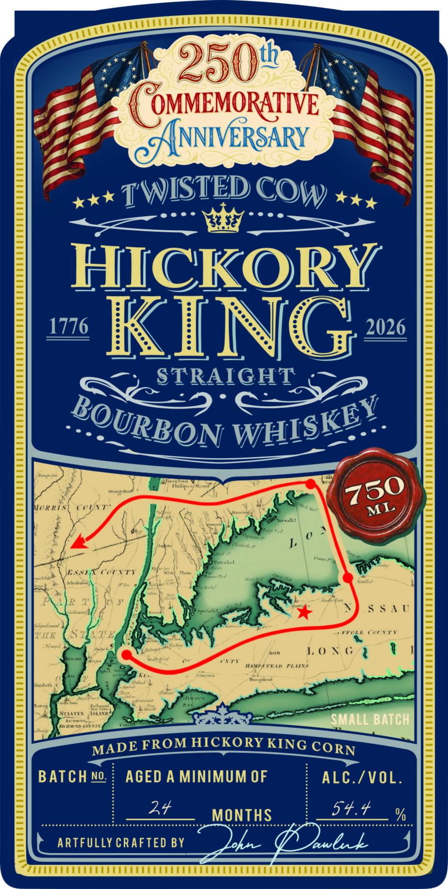
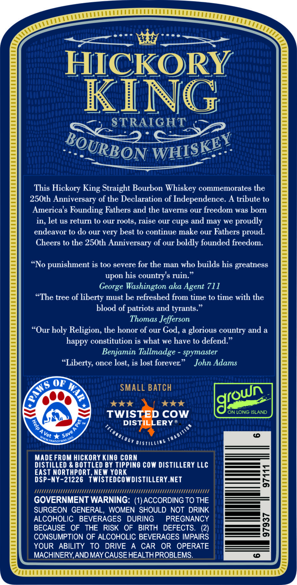

# TTB COLA Label Images - TTBID 26093001000638

**Brand Name:** HICKORY KING STRAIGHT BOURBON WHISKEY

**Issue Date:** 04/24/2026

**Origin Code:** 02

**Product Class/Type:** 101

**Source:** [TTB Public COLA Registry](https://ttbonline.gov/colasonline/viewColaDetails.do?action=publicFormDisplay&ttbid=26093001000638)

## Label Images

### Front Label

### Label 2

## Extracted Label Text

*Text extracted via OCR - may contain errors*

### Front Label

2504
OMMEMORATIVE
ANNIVERSARY
TWISTED
HICKORY
1776
KING
2026
STRAIGHT
IaR
((U
SSA"
TUE
t
1.0 N (
Murt
FL
~
SMALL Batch
KmU
FROM HICKORY KING CORN
BATCH No
AGED A MINIMUM OF
ALC./VOL.
24
MONTHS
54.4
ARTFULLY CRAFTED BY
awbh
I
COW
WHISKEY
BOURBON
750
Fuu:
ML
MADE

### Label 2

HICKORY
KING

mY mt et | | elt

STRAIGHT ,

This Hickory King Straight Bourbon Whiskey commemorates the
250th Anniversary of the Declaration of Independence. A tribute to
America's Founding Fathers and the taverns our freedom was born
in, let us return to our roots, raise our cups and may we proudly
endeavor to do our very best to continue make our Fathers proud.

Cheers to the 250th Anniversary of our boldly founded freedom.

“No punishment is too severe for the man who builds his greatness
upon his country's ruin.”
George Washington aka Agent 711
“The tree of liberty must be refreshed from time to time with the
blood of patriots and tyrants.”
Thomas Jefferson
“Our holy Religion, the honor of our God, a glorious country and a
happy constitution is what we have to defend.”
Benjamin Tallmadge - spymaster
“Liberty, once lost, is lost forever.” John Adams

SMALL BATCH
(own.
tokk kok g

TWIS COW
DISTILLERY ®

TS

‘ON LONG ISLAND

%p
er a srs

MADE FROM HICKORY KING CORN

DISTILLED & BOTTLED BY TIPPING COW DISTILLERY LLC
EAST NORTHPORT, NEW YORK

DSP-NY-21226 TWISTEDCOWDISTILLERY.NET
NTA
GOVERNMENT WARNING: (1) ACCORDING TO THE
SURGEON GENERAL, WOMEN SHOULD NOT DRINK
ALCOHOLIC BEVERAGES DURING PREGNANCY
BECAUSE OF THE RISK OF BIRTH DEFECTS. (2)
CONSUMPTION OF ALCOHOLIC BEVERAGES IMPAIRS
YOUR ABILITY TO DRIVE A CAR OR OPERATE
MACHINERY, AND MAY CAUSE HEALTH PROBLEMS.
