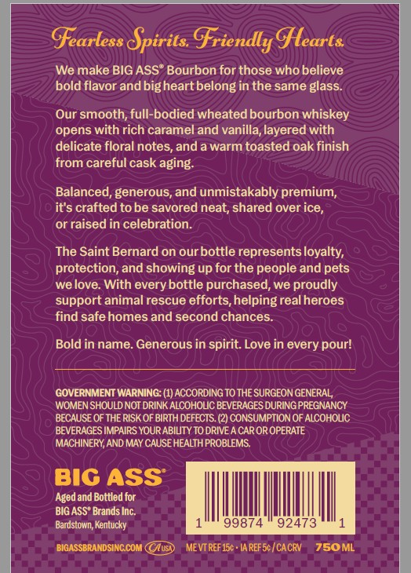
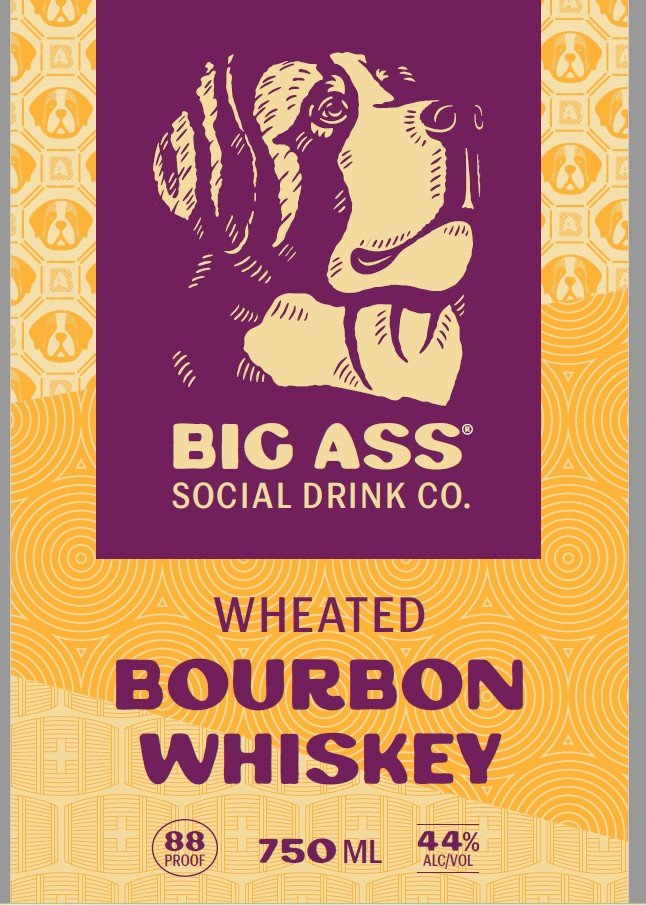
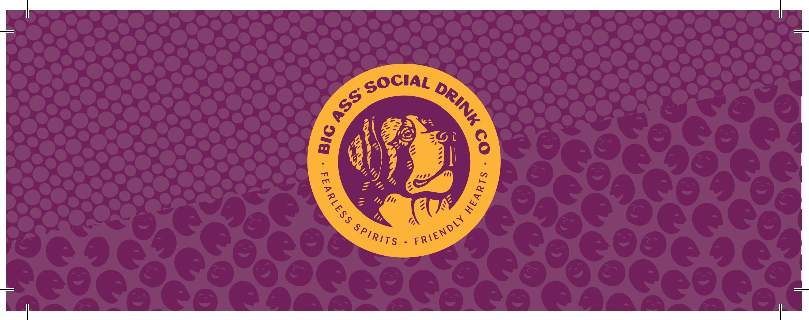

# TTB COLA Label Images - TTBID 26094001000006

**Brand Name:** BIG ASS SOCIAL DRINK CO.

**Issue Date:** 04/07/2026

**Origin Code:** 22

**Product Class/Type:** 141

**Source:** [TTB Public COLA Registry](https://ttbonline.gov/colasonline/viewColaDetails.do?action=publicFormDisplay&ttbid=26094001000006)

## Label Images

### Back Label

### Label 1

### Label 3

## Extracted Label Text

*Text extracted via OCR - may contain errors*

*2 image(s) excluded: text did not meet readability threshold*

### Back Label

Gearless pirits Griendly glearts
We make BIG ASS" Bourbon for those who believe
bold flavor and bigheart belong in the same glass
Our smooth; full-bodied wheated bourbon whiskey
opens with rich caramel and vanilla, layered with
delicate floral notes;
a warm toasted oak finish
from careful cask aging:
Balanced, generous, and unmistakably premium;
it's crafted to be savored neat; shared over ice,
or raised in celebration.
The Saint Bernard on ourbottle represents loyalty;
protection, and showing up for the people and pets
we love: With every bottle purchased, we proudly
support animal rescue efforts,helpingreal heroes
find safe homes and second chances
Bold in name. Generous in spirit: Love in every pour!
GOVERNMENT WARNING: (1) ACCORDING TO THE SURGEON GENERAL
WOMEN SHOULD NOT DRINK ALCOHOUC BEVERAGES DURING PREGNANCY
BECAUSE OF THE RISK OF BIRTH DEFECTS
CONSUMPTION OF ALCOHOLC
BEVERAGES IMPAIRS YOUR ABIUTY TO DRIVE A CAR OR OPERATE
MACHINERY AND MAY CAUSEHEALTH PROBLEMS
BIC ASS
Aged and Bottled for
BIG ASS" Brands Inc.
Bardstown; Kentucky
99874
92473
BIGASSBRANDSINCCOM CAusD
ME VT REF 15c
IA REFSc /CACRV
750ML
and
