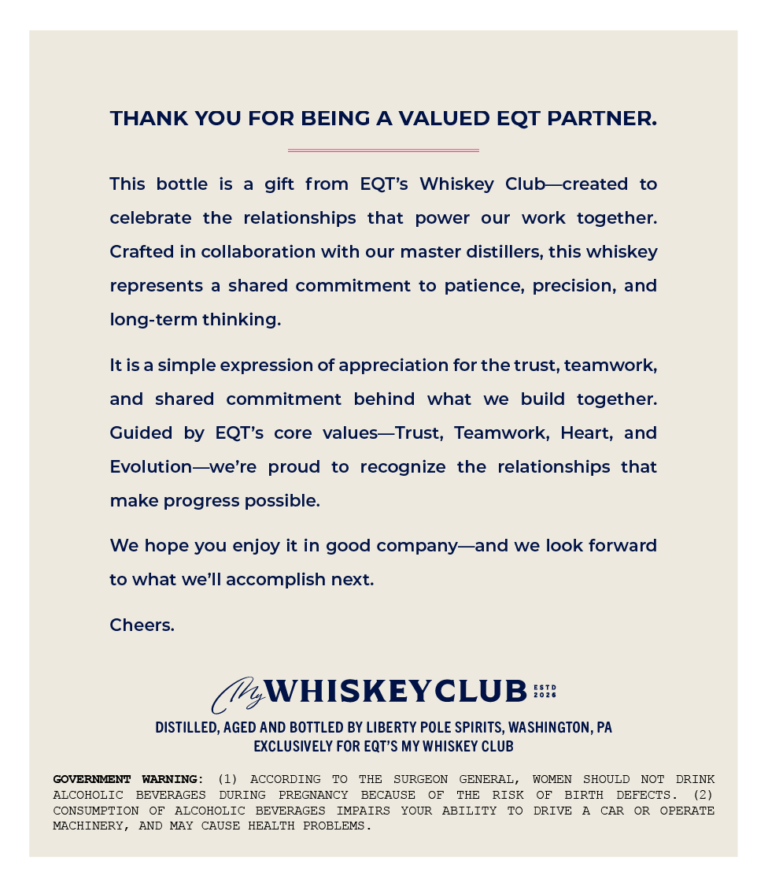
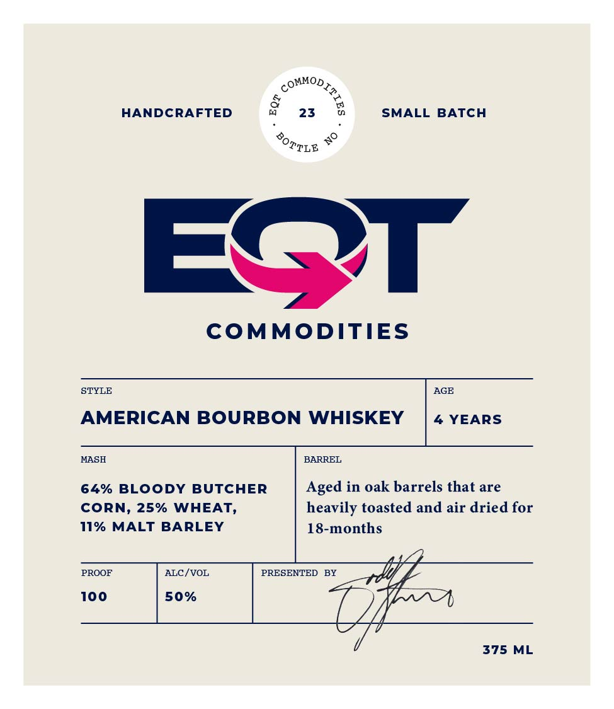

# TTB COLA Label Images - TTBID 26094001000078

**Brand Name:** EQT COMMODITIES

**Issue Date:** 04/14/2026

**Origin Code:** 39

**Product Class/Type:** 141

**Source:** [TTB Public COLA Registry](https://ttbonline.gov/colasonline/viewColaDetails.do?action=publicFormDisplay&ttbid=26094001000078)

## Label Images

### Back Label

### Front Label

## Extracted Label Text

*Text extracted via OCR - may contain errors*

**Detected Proof:** 100

### Back Label

THANK YOU FOR BEING A VALUED EQT PARTNER:
This
bottle
is
gift   from
EQT's  Whiskey
Club_created
to
celebrate
the
relationships
that
power
our
work   together:
Crafted in collaboration with our master distillers, this whiskey
represents
shared commitment to patience, precision, and
long-term thinking:
It is a simple expression of appreciation for the trust, teamwork;
and
shared
commitment
behind
what
we
build  together:
Guided
by
EQT's
core values_Trust, Teamwork, Heart, and
Evolution__we're
proud
to
recognize
the
relationships
that
make progress possible:
We hope you enjoy it in good company
and we look forward
to what we'Il accomplish next_
Cheers:
WHISKEYCLUB %
DISTILLED, AGED AND BOTTLED BY LIBERTY POLE SPIRITS, WASHINGTON, PA
EXCLUSIVELY FOR EQT'S MY WHISKEY CLUB
GOVERMMENT
WARNING :
(1)
ACCORDING
TO
THE
SURGEON
GENERAL _
WOMEN
SHOULD
NOT
DRINK
ALCOHOLIC
BEVERAGES
DURING
PREGNANCY
BECAUSE
OF
THE
RISK
OF
BIRTH
DEFECTS
(2)
CONSUMPTION
OF
ALCOHOLIC
BEVERAGES
IMPAIRS
YOUR
ABILITY
TO
DRIVE
CAR
OR
OPERATE
MACHINERY ,
AND
MAY
CAUSE
HEALTH
PROBLEMS

### Front Label

&
HANDCRAFTED
23
SMALL BATCH
49
EQT
COMMODITIES
STYLE
AGE
AMERICAN BOURBON WHISKEY
YEARS
MASH
BARREL
64% BLOoDy
BUTCHER
Aged in oak barrels that are
CORN, 25% WHEAT,
heavily toasted and air dried for
11% MALT
BARLEY
18-months
PROOF
ALC /VOL
PRESENTED
BY
100
50%
375
ML
~"MODIR e
BOTTLE
