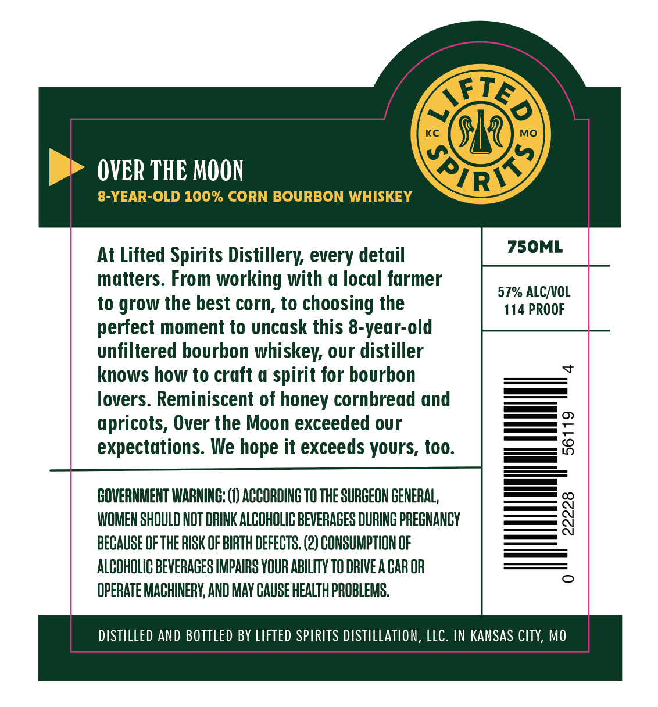
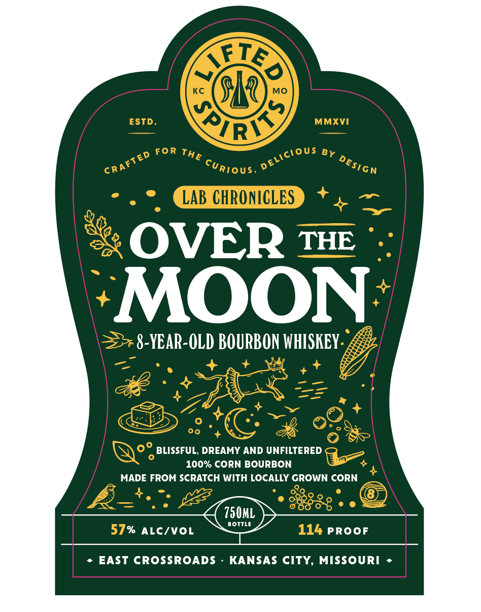
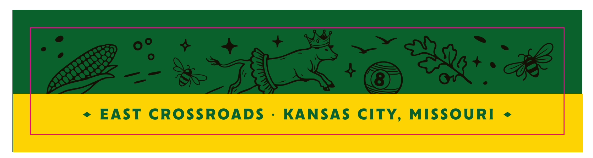

# TTB COLA Label Images - TTBID 26094001000120

**Brand Name:** LIFTED SPIRITS

**Issue Date:** 04/15/2026

**Origin Code:** 29

**Product Class/Type:** 141

**Source:** [TTB Public COLA Registry](https://ttbonline.gov/colasonline/viewColaDetails.do?action=publicFormDisplay&ttbid=26094001000120)

## Label Images

### Back Label

### Front Label

### Label 2

## Extracted Label Text

*Text extracted via OCR - may contain errors*

**Detected Proof:** 114

### Back Label

0
KC
MO
OVER THE MOON
XVy
8-YEAR-OLD 100% CORN BOURBON WHISKEY
At Lifted Spirits Distillery every detail
75OML
matters. From working with a local farmer
57% ALCNOL
to grow the best corn, to choosing the
114 PROOF
perfect moment to uncask this &-year-old
unfiltered bourbon whiskey; our distiller
knows how to craft @ spirit for bourbon
lovers. Reminiscent of honey cornbread and
apricots, Over the Moon exceeded our
expectations  We hope it exceeds yours, too
8
GOVERNMENT WARNING: (1) ACCORDING TO THE SURGEON GENERAL,
WOMEN SHOULD NOT DRINK ALCOHOLIC BEVERAGES DURING PREGNANCY
8
BECAUSE OF THE RISK OF BIRTH DEFECTS. (2) CONSUMPTION OF
ALCOHOLIC BEVERAGES IMPAIRS YOUR ABILITY TO DRIVE A CAR OR
OPERATE MACHINERV, AND MAY CAUSE HEALTH PROBLEMS,
diStILLed AND BOTTLEd BY LIFTED SPIRITS DISTILLATION, LLC. IN KanSaS CITY, MO
AIFT

### Front Label

0
KC
MO
ESTD _
QVY
MMXVI
FoR
LAB CHRONICLES
OVER THE
MOON
8-YEAR-OLD BOURBON WHISKEY .
BLISSFUL, DREAMY AND UNFILTERED
100% CORN BOURBON
MADE FROM SCRATCH WITH LOCALLY GROWN CORN
750mL
BOTTLE
57%
ALc/VOL
114 PROOF
EAST CROSSROADS
KANSAS CITY,
MISSOURI
TE
LF
DeLiciOUS
THE
BY
CRAFTED
DESIGN
CuRious,

### Label 2

EAST CROSSROADS
KANSAS
CITY
MISSOURI
