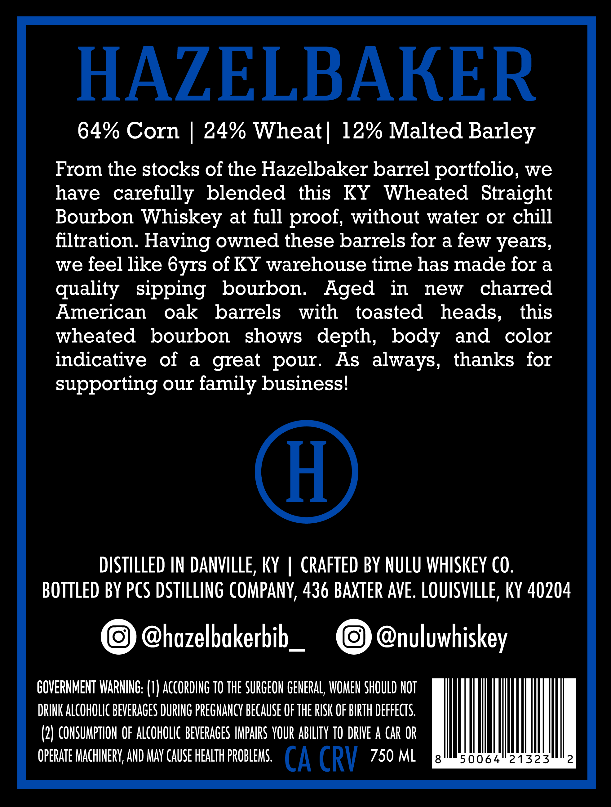
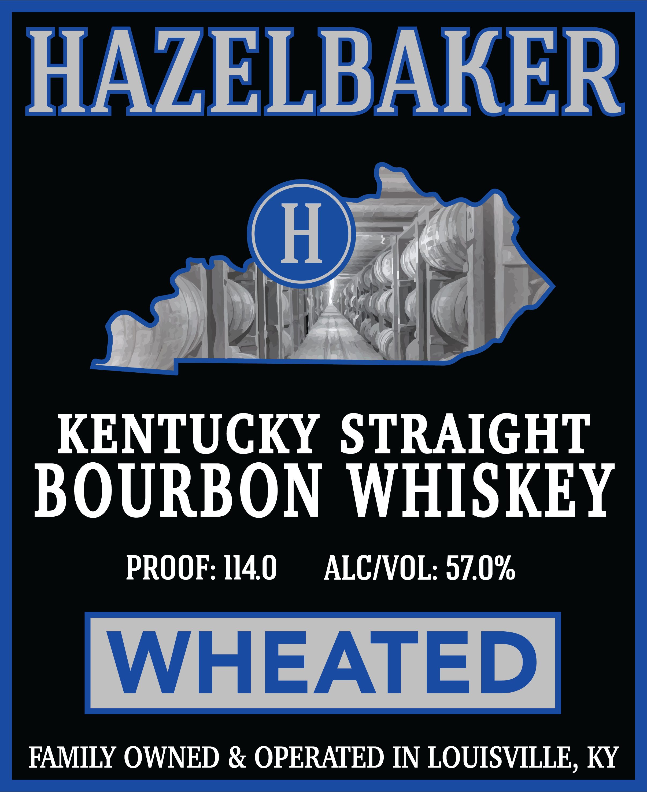
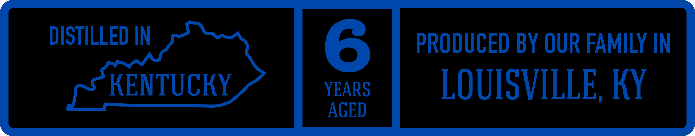

# TTB COLA Label Images - TTBID 26095001000004

**Brand Name:** HAZELBAKER

**Issue Date:** 04/15/2026

**Origin Code:** 22

**Product Class/Type:** 101

**Source:** [TTB Public COLA Registry](https://ttbonline.gov/colasonline/viewColaDetails.do?action=publicFormDisplay&ttbid=26095001000004)

## Label Images

### Back Label

### Front Label

### Label 2

## Extracted Label Text

*Text extracted via OCR - may contain errors*

**Detected Proof:** 114
**Detected Age:** 6 Years

### Back Label

HAZELBAKER

64% Corn | 24% Wheat| 12% Malted Barley

From the stocks of the Hazelbaker barrel portfolio, we
have carefully blended this KY Wheated Straight
Bourbon Whiskey at full proof, without water or chill
filtration. Having owned these barrels for a few years,
we feel like 6yrs of KY warehouse time has made for a
quality sipping bourbon. Aged in new charred
American oak barrels with toasted heads, this
wheated bourbon shows depth, body and color
indicative of a great pour. As always, thanks for
supporting our family business!

DISTILLED IN DANVILLE, KY | CRAFTED BY NULU WHISKEY CO.
BOTTLED BY PCS DSTILLING COMPANY, 436 BAXTER AVE. LOUISVILLE, KY 40204

@hazelbakerbib_ @nuluwhiskey

GOVERNMENT WARNING: (1) ACCORDING TO THE SURGEON GENERAL, WOMEN SHOULD NOT
DRINK ALCOHOLIC BEVERAGES DURING PREGNANCY BECAUSE OF THE RISK OF BIRTH DEFFECTS.
(2) CONSUMPTION OF ALCOHOLIC BEVERAGES IMPAIRS YOUR ABILITY TO DRIVE A CAR OR
OPERATE MACHINERY, AND MAY CAUSE HEALTH PROBLEMS. (A CRY 750 ML Fee eval cee

### Front Label

HAZELBARER

KENTUCKY STRAIGHT
BOURBON WHISKEY

PROOF: 1140 ALC/VOL: 57.0%

WHEATED

FAMILY OWNED & OPERATED IN LOUISVILLE, KY

### Label 2

DISTILLED IN
6
PRODUCED BY OUR FAMILY IN
KENTUCKY
YEARS
LOUISVILLE, KY
AGED
