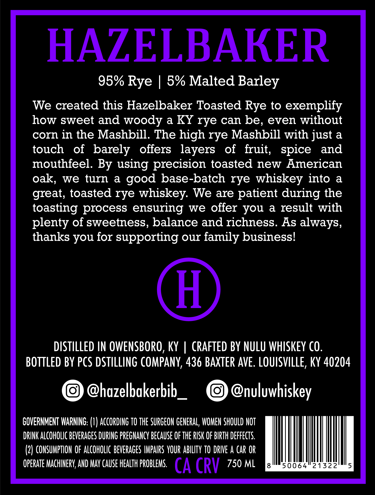
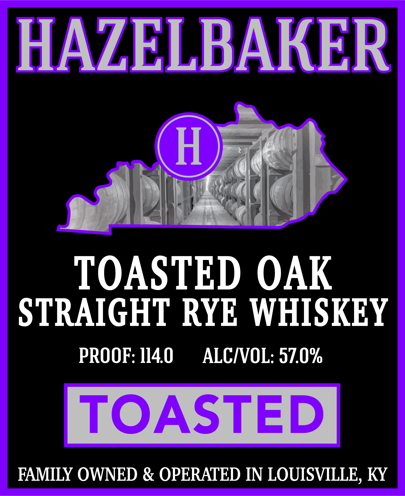
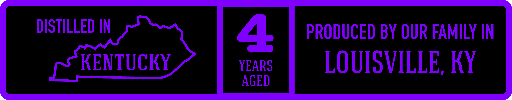

# TTB COLA Label Images - TTBID 26095001000005

**Brand Name:** HAZELBAKER

**Issue Date:** 04/07/2026

**Origin Code:** 22

**Product Class/Type:** 102

**Source:** [TTB Public COLA Registry](https://ttbonline.gov/colasonline/viewColaDetails.do?action=publicFormDisplay&ttbid=26095001000005)

## Label Images

### Back Label

### Front Label

### Label 2

## Extracted Label Text

*Text extracted via OCR - may contain errors*

**Detected Proof:** 114

### Back Label

HAZELBAKER

95% Rye | 5% Malted Barley

We created this Hazelbaker Toasted Rye to exemplify
how sweet and woody a KY rye can be, even without
corn in the Mashbill. The high rye Mashbill with just a
touch of barely offers layers of fruit, spice and
mouthfeel. By using precision toasted new American
oak, we turn a good base-batch rye whiskey into a
great, toasted rye whiskey. We are patient during the
toasting process ensuring we offer you a result with
plenty of sweetness, balance and richness. As always,
thanks you for supporting our family business!

DISTILLED IN OWENSBORO, KY | CRAFTED BY NULU WHISKEY CO.
BOTTLED BY PCS DSTILLING COMPANY, 436 BAXTER AVE. LOUISVILLE, KY 40204

@hazelbakerbib_ @nuluwhiskey

GOVERNMENT WARNING: (1) ACCORDING TO THE SURGEON GENERAL, WOMEN SHOULD NOT
DRINK ALCOHOLIC BEVERAGES DURING PREGNANCY BECAUSE OF THE RISK OF BIRTH DEFFECTS.
(2) CONSUMPTION OF ALCOHOLIC BEVERAGES IMPAIRS YOUR ABILITY TO DRIVE A CAR OR
OPERATE MACHINERY, AND MAY CAUSE HEALTH PROBLEMS. (A CRV 750 ML Fuel yala ete

### Front Label

HAZELBARER

aplD

fl

Bit

:

TOASTED OAK

STRAIGHT RYE WHISKEY

PROOF: 1140 ALC/VOL: 57.0%

FAMILY OWNED & OPERATED IN LOUISVILLE, KY

### Label 2

DISTILLED IN
4
PRODUCED BY OUR FAMILY IN
KENTUCKY
YEARS
LOUISVILLE, KY
AGED
