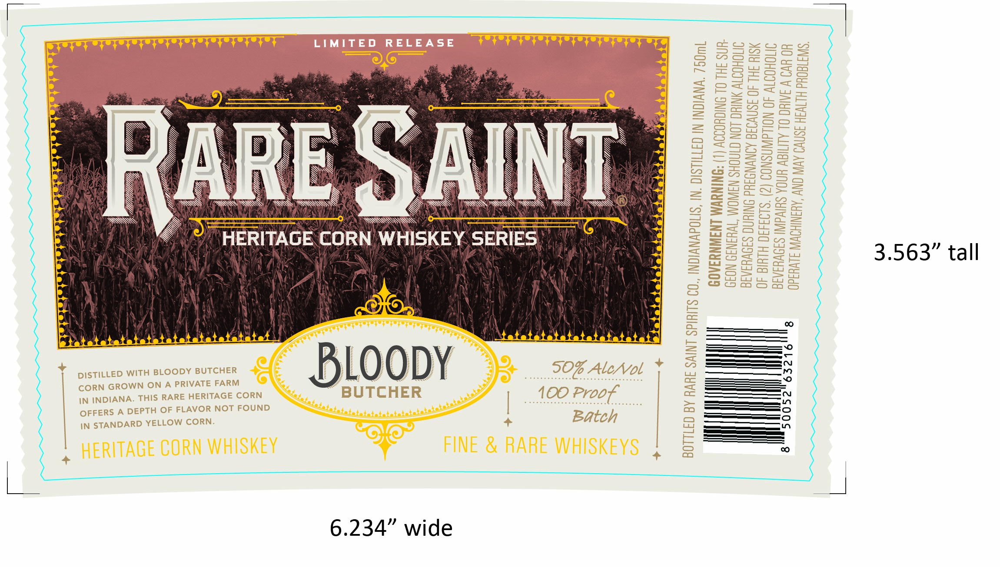

# TTB COLA Label Images - TTBID 26095001000124

**Brand Name:** RARE SAINT

**Issue Date:** 04/20/2026

**Origin Code:** 19

**Product Class/Type:** 143

**Source:** [TTB Public COLA Registry](https://ttbonline.gov/colasonline/viewColaDetails.do?action=publicFormDisplay&ttbid=26095001000124)

## Label Images

### Back Label

## Extracted Label Text

*Text extracted via OCR - may contain errors*

### Back Label

LIMITED
RELEASE
12
884
3
1
~
2
5
1
3
#
5
2
2
2
RARE SAINT
8
=
80
8
88
3
H
7
2
HERITAGE CORN WHISKEY SERIES
]
0038
Mx
5
8
B8
8
6
c
DISTILLED WiTH BLOODY BUTCHER
BLoody
507.AlcNol
3
3
CORN GROWN ON A PRIVATE FARM
2
IN INDIANA_
ThIS RARE HERITAGE CORN
BUTCHER
402.Proot
OFFERS A DEPTH OF FLAVOR NOT FOUND
25
1
IN STANDARD YELLOW CORN
Batch
HERITAGE CORN WhISkEY
FINE & RARE WHISKEYS
1
