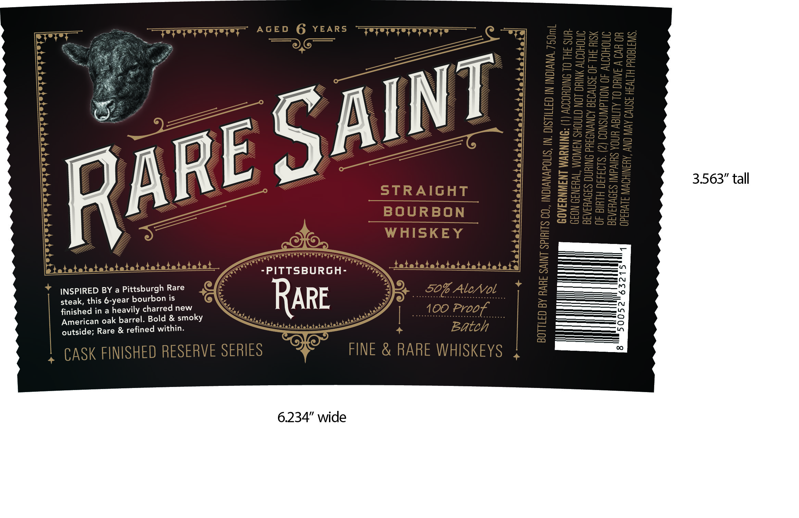

# TTB COLA Label Images - TTBID 26095001000126

**Brand Name:** RARE SAINT

**Issue Date:** 04/22/2026

**Origin Code:** 19

**Product Class/Type:** 101

**Source:** [TTB Public COLA Registry](https://ttbonline.gov/colasonline/viewColaDetails.do?action=publicFormDisplay&ttbid=26095001000126)

## Label Images

### Back Label

## Extracted Label Text

*Text extracted via OCR - may contain errors*

**Detected Proof:** 100
**Detected Age:** 6 Years

### Back Label

AGED 6
YEARS
{242034
2
2
2
5
53
=
8
2
1
2
8
88
[
53
2
I
3
32
STRAIGHT
HF
{
BOURBON
8
3
9
5
3
2
WHISKEY
1
PITTSBURGH-
3
INSPIRED BY a Pittsburgh Rare
50% AlcNol
1
3
steak, this 6-year bourbon is
RARE
6
finished in
heavily charred new
100_Proof
American oak barrel. Bold & smoky
{
outside; Rare & refined within:
Batch
8
CASK FINISHED RESERVE SERIES
FINE & RARE WHISKEYS
0
SAINT
RARE
