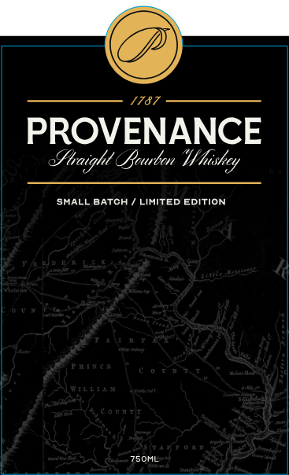
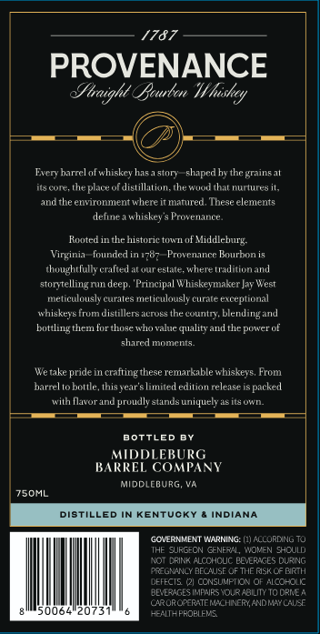

# TTB COLA Label Images - TTBID 26096001000040

**Brand Name:** PROVENANCE

**Issue Date:** 04/07/2026

**Origin Code:** 05

**Product Class/Type:** 101

**Source:** [TTB Public COLA Registry](https://ttbonline.gov/colasonline/viewColaDetails.do?action=publicFormDisplay&ttbid=26096001000040)

## Label Images

### Front Label

### Label 1

## Extracted Label Text

*Text extracted via OCR - may contain errors*

### Front Label

1787
PROVENANCE
Jhaight Bcurbcn "Hf hishcy
SMALL BATCH
LIMITED EDITION
i
3

### Label 1

1787
PROVENANCE
Jhaight Rcurbon
Evcr harrec]ofwhiskcyhas > Stnry
shaped hythc
its cone  The
place of listillation_
Itemonatnutes
andthe environmnentwhere ir manired
These elements
UeeaWee
creman
Runted inthe historie towT
of Middleburg:
Virginia   founred
1787 Provenance Bnurhon is
thuughtfully crafted at vurestate  where traditionand
Stor;Telling ,
deep. 'Principal Whiskevmaker Jay West
TinetusunesmeuauseCmte
exceptional
Shiskerstrum distillers aeros; the countr
blending and
buttlingthem forthose who value quality andthe power
Eharedannmcn
Wetake
pridein crafting
remarkable whiskeye,
barreltobottle, thisyearslimited
packed
Ilavor aund pruudly atands uniquelyasitsown
BOTTLED BY
MIDDLEBURG
BARREL COMPANY
MiddlcburG; Va
ZSOML
DIstiLLed IN KENTUCKY
INDIANA
GOVERNKENT VIARNING:
ALCORLING TO
THE JURG-CN
CFNEOO
WOVEN CHCULD
CFINK ALCCHICUC PEVERNGES DURNG
ROEGNANCY BFCAUSE OF THE FaSk CF BIRTH
DEFFCTS
CCNSUMPTOON OF AcOHOLC
BLYLRNGES IMPAPS IOUR ABILITY
TO DRIL /
CARORORRTFMCCHNFRY ANDdecn
20751
HEALT PROPLENS
WVhushcy
Fnaing
Ieee
From
Editiout
Tcltase
Aite
