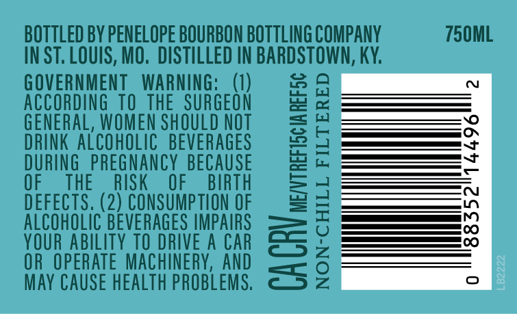
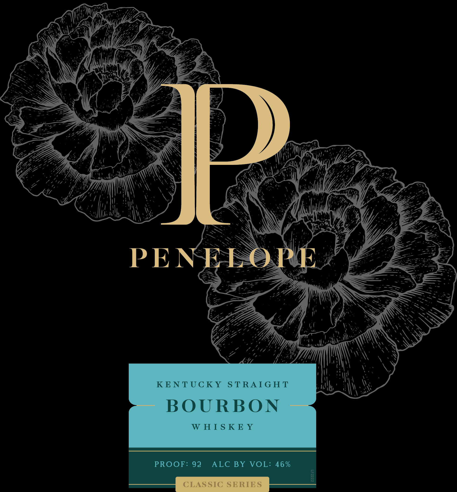

# TTB COLA Label Images - TTBID 26096001000060

**Brand Name:** PENELOPE

**Issue Date:** 04/07/2026

**Origin Code:** 29

**Product Class/Type:** 101

**Source:** [TTB Public COLA Registry](https://ttbonline.gov/colasonline/viewColaDetails.do?action=publicFormDisplay&ttbid=26096001000060)

## Label Images

### Back Label

### Front Label

### Label 3

## Extracted Label Text

*Text extracted via OCR - may contain errors*

*2 image(s) excluded: text did not meet readability threshold*

### Back Label

BOTTLED BY PENELOPE BOURBON BOTTLING COMPANY 750ML
INST. LOUIS, MO. DISTILLED IN BARDSTOWN, KY.

GOVERNMENT WARNING: (1)
ACCORDING TO THE SURGEON
GENERAL, WOMEN SHOULD NOT
DRINK ALCOHOLIC BEVERAGES
DURING PREGNANCY BECAUSE
OF THE RISK OF BIRTH
DEFECTS. (2) CONSUMPTION OF
ALCOHOLIC BEVERAGES IMPAIRS
YOUR ABILITY TO DRIVE A CAR
OR OPERATE MACHINERY, AND
MAY CAUSE HEALTH PROBLEMS, C5 2

ON-CHILL FILTERED

\ CRV ME/VTREFISCIA REF5¢
