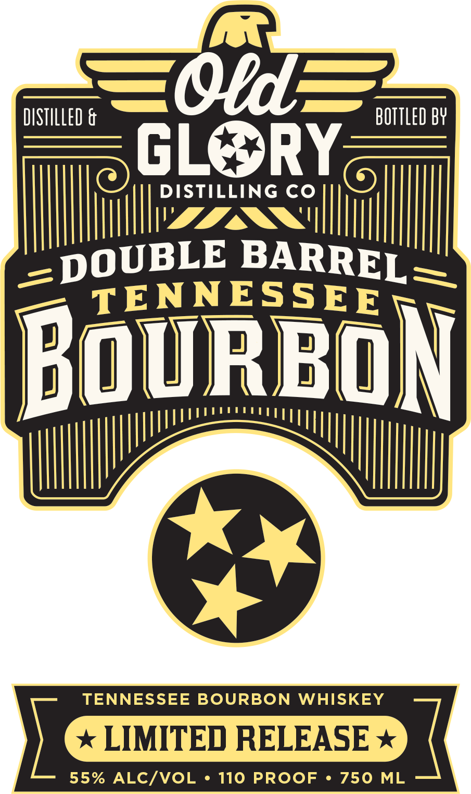

# TTB COLA Label Images - TTBID 26096001000267

**Brand Name:** DOUBLE BARREL TENNESSEE BOURBON

**Issue Date:** 04/07/2026

**Origin Code:** 43

**Product Class/Type:** 141

**Source:** [TTB Public COLA Registry](https://ttbonline.gov/colasonline/viewColaDetails.do?action=publicFormDisplay&ttbid=26096001000267)

## Label Images

### Back Label

### Front Label

## Extracted Label Text

*Text extracted via OCR - may contain errors*

*1 image(s) excluded: text did not meet readability threshold*

**Detected Proof:** 110

### Front Label

DISTILLED &
OrdE
BOTTLED BY
GL
RY
DISTILLING CO
DOUBLE
TENNESSEE
BouRBON
TENNESSEE BOURBON
WHISKEY
LIMITED RELEASE
55% ALC/VOL
110 PROOF
750
ML
BARREL =
