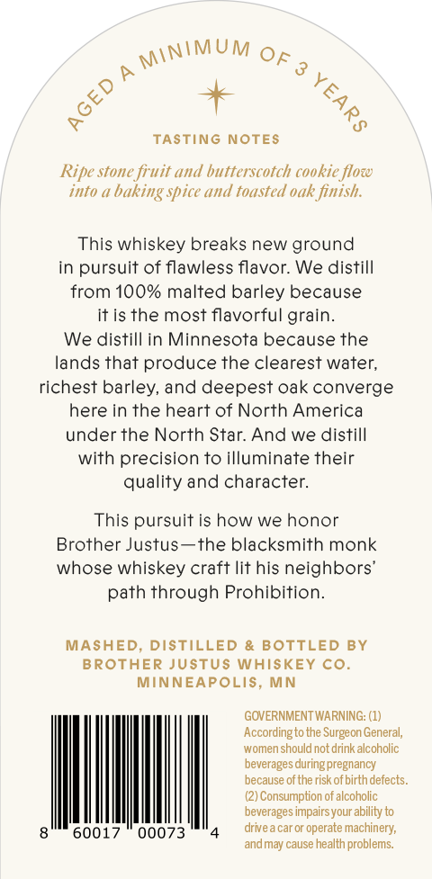
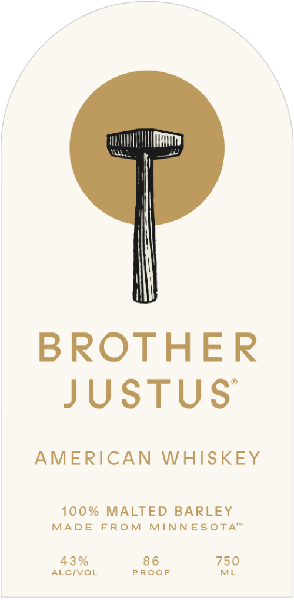

# TTB COLA Label Images - TTBID 26096001000339

**Brand Name:** BROTHER JUSTUS

**Issue Date:** 04/07/2026

**Origin Code:** 27

**Product Class/Type:** 140

**Source:** [TTB Public COLA Registry](https://ttbonline.gov/colasonline/viewColaDetails.do?action=publicFormDisplay&ttbid=26096001000339)

## Label Images

### Back Label

### Front Label

## Extracted Label Text

*Text extracted via OCR - may contain errors*

**Detected Proof:** 86

### Back Label

TASTING NOTES
Ripe stone fruit and butterscotch cookie flow
into 4
baking spice and toasted oak finish:
This whiskey breaks new ground
in pursuit of flawless flavor: We distill
from 100% malted barley because
itis the most flavorful grain:
We distill in Minnesota because the
lands that produce the clearest water;
richest barley, and deepest oak converge
here in the heart of North America
under the North Star And we distill
with precision to illuminate their
quality and character:
This pursuit is how we honor
Brother Justus
the blacksmith monk
whose whiskey craft lit his
neighbors"
path through Prohibition_
MASHED, DISTILLED
BOTTLED BY
BROTHER JuSTus WhIsKEY Co.
MINNEAPOLIS, MN
GOVERNMENT WARNING: (1)
Accordingto the Surgeon General,
women should not drink alcoholic
beverages during pregnancy
because of the risk ofbirth defects
Consumption of alcoholic
beverages impairsyour ability to
6001
00073
drive;
car or operate machinery;
andmay cause health problems:
MINIMUM
OF 3
1
2

### Front Label

BROTHER
JUSTUS
AMERICAN
WHISKEY
100% MALTED
BARLEY
MAD E
FRO M
MINNESOTA"
43 %
8 6
750
ALCIVOL
P ROOF
ML
